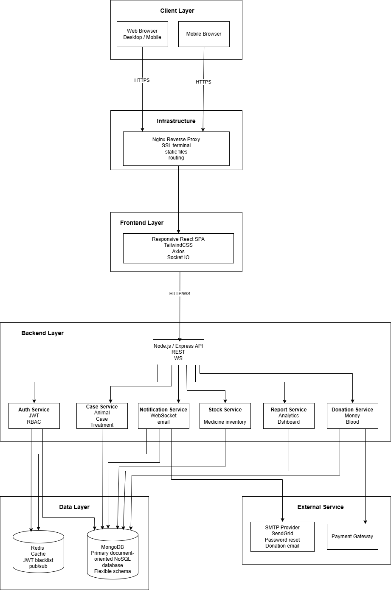
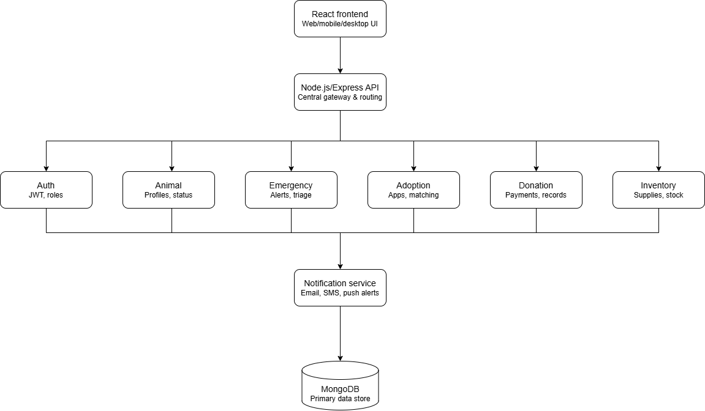
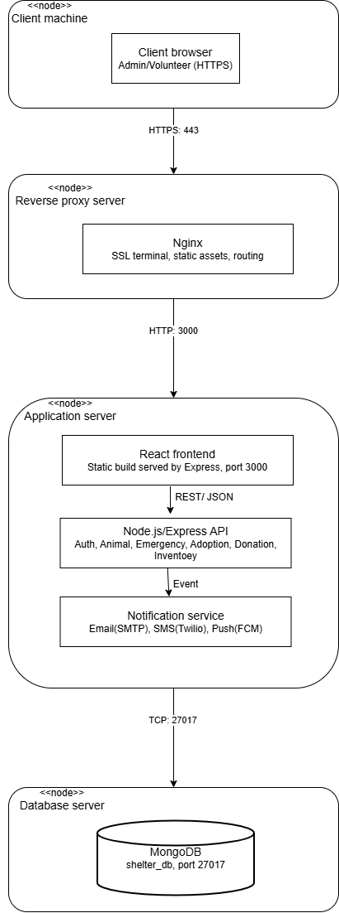
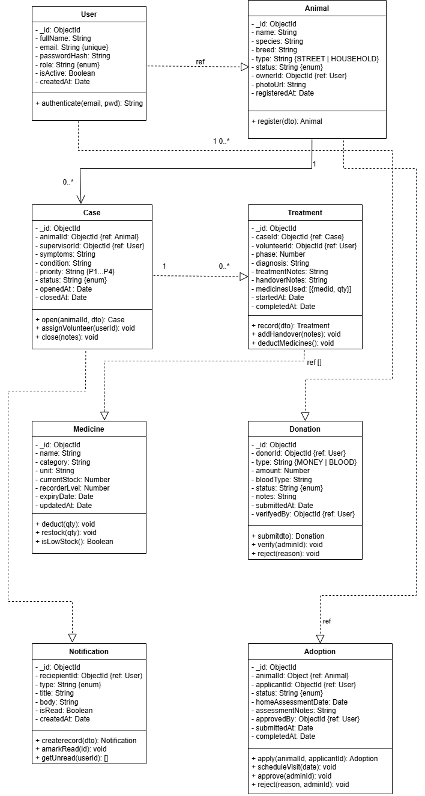
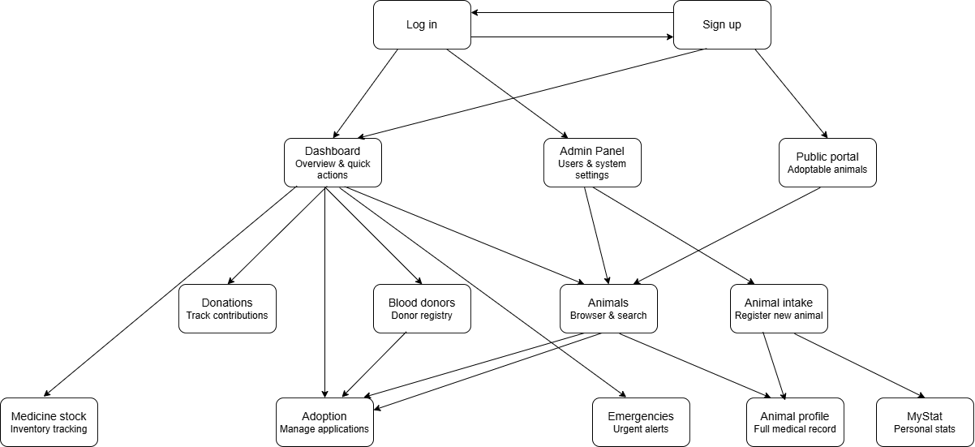

**SOFTWARE DESIGN SPECIFICATION**

**Animal Ark Veterinary Society Management System**

SENG 31242 - System Design Project

Group - Logic Lords (Group 6)

SE/2022/021

SE/2022/028

SE/2022/033

SE/2022/050

**Corrected Draft v1.1**

Prepared according to SENG 31242 SDS guideline structure

# Revision History

| **Version** | **Date** | **Description**                                                                                                         | **Prepared By** |
|-------------|----------|-------------------------------------------------------------------------------------------------------------------------|-----------------|
| 1.0         | 2026     | Initial SDS draft prepared from system design work                                                                      | Logic Lords     |
| 1.1         | 2026     | Corrected structure, fixed diagram/use-case mismatches, added database model, interface design and NFR design decisions | Logic Lords     |

# Table of Contents

1\. Introduction

2\. System Overview

3\. Architectural Design

4\. Detailed Design

5\. User Interface Design

6\. Interface Design

7\. Security Design

8\. Non-Functional Design Decisions

9\. Design Constraints

10\. References

# 1. Introduction

## 1.1 Purpose

This Software Design Specification (SDS) defines the complete technical
design of the Animal Ark Veterinary Society Management System. It
translates the approved Software Requirements Specification (SRS) into
an implementable design for the development phase. The document
describes the system architecture, major design decisions, data model,
class design, sequence diagrams, state machines, user interface design,
internal and external interfaces, security mechanisms, constraints, and
non-functional design decisions.

## 1.2 Scope

Animal Ark is a web-based platform for a student-led veterinary animal
welfare society. The system supports rescue and intake of stray or
injured animals, treatment tracking, handover notes between rotating
volunteer doctors, supervisor oversight, case closure, emergency alerts,
medicine stock control, money donations, blood donor registration,
adoption management, volunteer statistics, and a public portal for
donors, adopters and animal lovers.

The system supports the following user groups: Admin, Supervisor Doctor,
Volunteer Doctor, Donor, Adopter, Blood Donor Owner and Public Visitor.
Public visitors can browse published content and submit selected public
forms, while restricted operations are protected using authenticated
role-based access control.

## 1.3 References

| **Reference** | **Document / Source**                                                                   |
|---------------|-----------------------------------------------------------------------------------------|
| SRS           | Software Requirements Specification for Animal Ark Veterinary Society Management System |
| SENG31242     | SENG 31242 System Design Project - Course Guideline & Industrial Standards              |
| UML           | UML 2.x notation standard for class, sequence, deployment and state diagrams            |
| OWASP         | OWASP Top 10 Web Application Security Risks, 2021                                       |
| Mongoose      | Mongoose ODM documentation for MongoDB schema design                                    |
| ADR           | Architectural Decision Records stored in documents/architecture/decisions/              |

## 1.4 Document Overview

Section 2 summarises the system and its relationship to the SRS. Section
3 presents the architecture, diagrams and technology stack. Section 4
contains the detailed design, including classes, database model,
sequence diagrams and state machines. Section 5 presents user interface
design and navigation flow. Section 6 specifies external and internal
interfaces. Section 7 defines the security design. Section 8 maps
non-functional requirements to design decisions. Section 9 lists design
constraints and assumptions.

# 2. System Overview

The Animal Ark system is designed as a layered web application. A React
single-page application provides role-specific dashboards and a public
portal. A Node.js and Express backend exposes REST APIs and coordinates
domain services. MongoDB stores core operational data such as animals,
cases, treatment records, donations, adoption applications, blood donor
registry records and notifications. Redis supports short-lived cache
entries, token revocation and notification pub/sub. Socket.IO delivers
real-time alerts to dashboards for emergencies, handovers and stock
warnings.

The system directly realises the SRS use cases by mapping each
functional area to a separate module: Animal/Case, Treatment/Handover,
Emergency, Inventory, Donation, Blood Donor, Adoption, Reports and
Notification. This separation supports maintainability while keeping
deployment simple for the course development timeline.

| **SRS Area**                    | **Design Module**                  | **Main Design Artefacts**                                          |
|---------------------------------|------------------------------------|--------------------------------------------------------------------|
| Animal intake                   | Animal / Case Module               | Animal class, Animal Intake sequence, Animal Case state machine    |
| Treatment timeline and handover | Treatment Module                   | TreatmentUpdate class, Treatment and Handover sequences            |
| Supervisor oversight            | Case Module + Notification Service | Supervisor Review sequence and RBAC rules                          |
| Emergency alerts                | Emergency Alert Module             | EmergencyAlert class, WebSocket interface, Emergency state machine |
| Medicine stock                  | Inventory Module                   | Medicine and StockTransaction classes, stock state machine         |
| Donations                       | Donation Module                    | DonationCampaign and Donation classes, PayHere interface           |
| Blood donor registration        | Blood Donor Module                 | BloodDonor class and registry UI                                   |
| Adoption                        | Adoption Module                    | AdoptionApplication class and adoption state machine               |
| Volunteer statistics            | Reports Module                     | VolunteerStatistic class and dashboard sequence                    |
| Public portal                   | Public API + React Portal          | Public portal wireframe and navigation flow                        |

# 3. Architectural Design

## 3.1 Architecture Pattern

The selected architecture is a Layered N-Tier Architecture with an MVC
structure inside the application tier. React components act as the view
layer in the browser, Express controllers handle HTTP request routing
and validation, service classes implement business rules, and Mongoose
models manage persistence. This design was selected instead of
microservices because the project team is small and the current scope
can be implemented more reliably as a modular monolith. Internal service
boundaries are kept clear so that selected modules, such as notification
or reporting, can be separated later if required.

| **Tier**     | **Contents**                                                   | **Reason**                                                                                             |
|--------------|----------------------------------------------------------------|--------------------------------------------------------------------------------------------------------|
| Presentation | React SPA, public portal, role-based dashboards                | Supports fast UI updates, route guards and reusable components                                         |
| Gateway      | Nginx reverse proxy                                            | Provides HTTPS termination, static file serving and route forwarding                                   |
| Application  | Express API, controllers, services, RBAC middleware, Socket.IO | Centralises business logic and enables maintainable module boundaries                                  |
| Data         | MongoDB, Redis                                                 | MongoDB fits flexible animal/treatment records; Redis supports real-time pub/sub and short-lived cache |

## 3.2 Architectural Decision Justification

| **Decision**             | **Rationale**                                                                                        | **Alternatives Considered**         | **Trade-off Accepted**                                                |
|--------------------------|------------------------------------------------------------------------------------------------------|-------------------------------------|-----------------------------------------------------------------------|
| Layered modular monolith | Simpler development, testing and deployment for a 4-member team while still separating modules       | Microservices, serverless functions | Less independent scaling per module, but lower operational complexity |
| React SPA                | Supports dashboards, filtering, timelines and public portal pages with reusable UI components        | Server-rendered templates           | Requires frontend build pipeline but improves interactive UX          |
| MongoDB with Mongoose    | Flexible document structures fit treatment notes, photos, medicine usage arrays and campaign content | Relational SQL database             | Requires careful schema validation and indexing                       |
| Socket.IO notifications  | Real-time emergency and handover communication is a core workflow need                               | Polling, email only                 | Adds WebSocket infrastructure but reduces delay for critical alerts   |
| JWT + refresh token      | Scalable stateless API authentication with controlled session renewal                                | Server sessions only                | Requires careful token storage and revocation handling                |

## 3.3 Architecture Overview Diagram

## 3.4 Component / Package Diagram

## 3.5 Deployment Diagram

## 3.6 Technology Stack

| **Layer** | **Technology**               | **Version** | **Justification**                                                                  |
|-----------|------------------------------|-------------|------------------------------------------------------------------------------------|
| Frontend  | React                        | 18.x        | Component model supports reusable role-specific dashboards and public portal pages |
| Frontend  | React Router                 | 6.x         | Client-side routing with protected role-based routes                               |
| Frontend  | TailwindCSS                  | 3.x         | Utility-first styling supports consistent low-overhead UI development              |
| Frontend  | Axios                        | 1.x         | HTTP interceptors can attach access tokens and handle refresh logic                |
| Backend   | Node.js                      | 20 LTS      | Non-blocking I/O suits API and real-time notification workloads                    |
| Backend   | Express.js                   | 4.x         | Lightweight routing framework familiar to the team                                 |
| Backend   | Mongoose ODM                 | 8.x         | Schema validation, middleware and reference population for MongoDB                 |
| Backend   | Socket.IO                    | 4.x         | Bi-directional real-time events for emergency and handover alerts                  |
| Database  | MongoDB                      | 7.x         | Flexible document store for animal cases, treatment notes and public content       |
| Database  | Redis                        | 7.x         | Token blacklist, pub/sub and short-lived dashboard KPI cache                       |
| Security  | bcrypt                       | 5.x         | Password hashing with configurable work factor                                     |
| Security  | Joi                          | 17.x        | Request validation before controller logic                                         |
| External  | PayHere                      | Current API | Local payment gateway for Sri Lankan donation payments                             |
| External  | SendGrid/SMTP                | Current API | Password reset, donation acknowledgements and alert emails                         |
| Storage   | AWS S3 or local file storage | Current     | Animal photos with controlled upload and retrieval                                 |
| DevOps    | Docker Compose               | v2          | Environment parity and simple deployment for development phase                     |
| DevOps    | GitHub Actions               | Current     | Automated lint/test/build pipeline during development                              |

# 4. Detailed Design

## 4.1 Class Diagram

## 4.2 Class Specifications

| **Class**           | **Key Attributes**                                                                                         | **Key Methods**                                                        | **Relationships / Notes**                                                                         |
|---------------------|------------------------------------------------------------------------------------------------------------|------------------------------------------------------------------------|---------------------------------------------------------------------------------------------------|
| User                | \_id, fullName, email, passwordHash, role, isActive, createdAt, updatedAt                                  | authenticate(), resetPassword(), deactivate(), toPublicProfile()       | Registers animals, supervises cases, records treatments, receives notifications depending on role |
| Animal              | \_id, name, species, breed, age, gender, type, status, foundLocation, photoUrls, ownerId                   | register(), updateStatus(), addPhoto(), getActiveCase()                | Has many cases and adoption applications                                                          |
| Case                | \_id, animalId, supervisorId, currentVolunteerId, priority, condition, status, openedAt, closedAt          | open(), assignSupervisor(), assignVolunteer(), close()                 | Belongs to one animal and has many treatment updates                                              |
| TreatmentUpdate     | \_id, caseId, volunteerId, diagnosis, treatmentNotes, handoverNotes, medicinesUsed, startedAt, completedAt | record(), addHandover(), deductMedicines()                             | Belongs to one case and can use many medicines                                                    |
| Medicine            | \_id, name, category, unit, currentStock, reorderLevel, expiryDate                                         | deduct(), restock(), isLowStock(), isExpired()                         | Has many stock transactions                                                                       |
| StockTransaction    | \_id, medicineId, caseId, type, quantity, performedBy, reason, createdAt                                   | recordUse(), recordRestock(), reverse()                                | Audits inventory changes                                                                          |
| EmergencyAlert      | \_id, caseId, status, severity, location, message, raisedBy, respondedBy, resolvedAt                       | activate(), respond(), escalate(), resolve(), cancel()                 | Linked to a case and emits notifications                                                          |
| DonationCampaign    | \_id, title, description, targetAmount, raisedAmount, status, startDate, endDate                           | publish(), updateProgress(), close(), cancel()                         | Has many donations                                                                                |
| Donation            | \_id, campaignId, donorName, donorContact, amount, method, paymentRef, status                              | submit(), verify(), reject(), sendReceipt()                            | Can be public or linked to a registered donor                                                     |
| BloodDonor          | \_id, petName, species, bloodType, ownerName, ownerContact, location, availability                         | register(), updateAvailability(), match()                              | Used for emergency blood donor matching                                                           |
| AdoptionApplication | \_id, animalId, applicantName, contact, homeDetails, status, assessmentNotes                               | apply(), scheduleAssessment(), approve(), reject(), completeHandover() | Updates animal status when adoption completes                                                     |
| Notification        | \_id, recipientId, type, title, body, isRead, createdAt                                                    | create(), markRead(), getUnread()                                      | Created by domain services and emitted in real time                                               |
| VolunteerStatistic  | \_id, volunteerId, month, casesHandled, hours, updates, emergencies                                        | calculate(), rank(), resetMonthly()                                    | Aggregated from cases and treatment updates                                                       |

| **Collection**        | **Important Indexes**                      | **Design Notes**                                                          |
|-----------------------|--------------------------------------------|---------------------------------------------------------------------------|
| users                 | unique(email), role, isActive              | Single user collection with role-based access control                     |
| animals               | status, species, ownerId                   | Animal profile remains even after case closure to preserve history        |
| cases                 | animalId, supervisorId, status, priority   | Supervisor is immutable after assignment unless admin override is audited |
| treatment_updates     | caseId, volunteerId, completedAt           | Timeline entries are ordered by created/completed time                    |
| medicines             | name, category, expiryDate, currentStock   | Stock thresholds trigger notifications                                    |
| stock_transactions    | medicineId, caseId, performedBy, createdAt | Provides audit trail for stock use and restocking                         |
| emergency_alerts      | caseId, status, severity, createdAt        | Active alerts are shown on dashboards using WebSocket events              |
| donation_campaigns    | status, endDate                            | Only ACTIVE campaigns are shown on the public portal                      |
| donations             | campaignId, status, paymentRef             | Webhook updates payment status                                            |
| blood_donors          | species, bloodType, location, availability | Searchable registry for urgent matching                                   |
| adoption_applications | animalId, status, submittedAt              | Applications drive adoption review workflow                               |
| notifications         | recipientId, isRead, createdAt             | Unread notifications are shown per user                                   |

## 4.3 Sequence Diagrams

The sequence diagrams below correct the previous title-flow mismatches.
Each diagram represents one major SRS use case and shows the main
successful path. Alternative and exception flows are handled by
validation, error responses, RBAC checks and service-level guards
described in the API and security sections.

### SD-01 Animal Intake and Profile Creation

### SD-02 Open Treatment Case

### SD-03 Update Treatment Timeline

### SD-04 Add Handover Notes

### SD-05 Supervisor Review and Approval

### SD-06 Close Animal Case

### SD-07 Emergency Alert Handling

### SD-08 Medicine Stock Management

### SD-09 Donation Management

### SD-10 Blood Donor Registration

### SD-11 Adoption Flow

### SD-12 Volunteer Statistics and Dashboard

### SD-13 Public Portal Interaction

## 4.4 State Machine Diagrams

State machine diagrams are provided for the stateful entities whose
status values change during system operation.

### Animal Case Lifecycle

### Adoption Application Lifecycle

### Emergency Alert Lifecycle

### Donation Campaign Lifecycle

### Medicine Stock Lifecycle

### Blood Donation Request

## 4.5 Database / Data Model Design

### 4.6 MongoDB Collection

The database is modelled as MongoDB collections with ObjectId references between related documents. Although MongoDB is document-oriented, the following entity-relationship view defines ownership, references and cardinality. Treatment updates embed medicine usage line items, while stock movements are recorded separately in StockTransaction for auditability.

# 5. User Interface Design

## 5.1 Wireframes for Major Screens

The UI uses role-based navigation and consistent visual patterns. The
wireframes below show the corrected major screens required by the
system. Final high-fidelity UI files should be stored in the prototypes
repository and exported into the SDS folder with source files.

### WF-01 Login

● Animal Arc paw logo and "Animal Arc" heading centered at top of card
● "Veterinary Society Management" subtitle in muted text below heading
● EMAIL labelled text input field
● PASSWORD labelled masked input field with "Forgot Password?" link inline on the right
● Full-width "Sign in" primary button
● "Don't have an account? Sign up" link below button navigates to WF-02
● Role is determined from JWT payload after sign-in; no role selector shown on this screen
● Inline error banner appears above email field on failed credentials

### WF-02 Sign Up

● Animal Arc paw logo and "Animal Arc" heading centered at top of card
● "Veterinary Society Management" subtitle in muted text below heading
● NAME labelled text input field
● EMAIL labelled text input field with format validation
● PASSWORD labelled masked input field
● CONFIRM PASSWORD labelled masked input field with inline match validation
● ROLE labelled dropdown or segmented selector
● Full width "Sign up" primary button
● "Already have an account? Log in" link below button navigates back to WF-01
● Successful sign-up redirects to Dashboard (WF-03) after account creation

### WF-03 Role Dashboard

● Top navigation bar: Animal Arc logo on the left, user avatar on the right
● Three KPI stat cards in a row: Active Rescued, My Assigned, Emergencies
● MY ACTIVE CASES section: vertical list of case cards, each showing animal initial avatar (coloured circle), animal name and case ID, condition description, 29 | Page
and a colour-coded status badge (Treatment → amber, Stable → green, Monitored → blue)
● Blue navigation arrows on left and right sides of the case list for pagination
● Navigation flow connections visible to Animal Profile, Animals list, Sign Up, Adoption, and Emergency Alert screens

### WF-04 Animal Profile and Treatment Timeline

● Back arrow and breadcrumb: "Case #038 Dog"
● "Active treatment" status badge and "+ Add update" button in page header
● Left column Animal details card:
o Real animal photo displayed (dog photo visible in wireframe)
o Metadata table: Species, Breed, Est. age, Intake date, found at, Condition tag
● Right column Care team panel:
o Supervisor section: avatar initials (DW), doctor name, "Assigned supervisor All updates" label
o Volunteers on case: row of three circular avatar bubbles with initials (JW, KP, NS)
o Current medicines section: medicine name, dose, and frequency per active medicine
● TREATMENT TIMELINE section (full width below):
o Vertical chronological list; each entry shows date and time, volunteer name, note text, and an entry-type badge
o Entry badge types: Improving → green, Handover note → blue, Supervisor instruction → purple, Intake → gray
o Entries with unread status shown with an open circle indicator on the left

### WF-05 Animals List

● Top bar: search input and Filter button on the left; "+ Register animal" primary button top-right
● Left filter sidebar: FILTER BY STATUS pills (All, Emergency, Active, Recovered, Adopted with counts); FILTER BY TYPE pills (Dog, Cat, Other with counts)
● Main content: responsive image grid of animal cards (3 columns visible)
● Each animal card: actual animal photo, colour-coded status badge overlaid on photo, animal name and case ID, short condition note, "View case" button 30 | Page
● Status badge colours: Emergency → red, Treatment → amber, Stable → green, monitored → blue, Recovered → dark gray, Adoption ready → teal
● Clicking "View case" navigates to WF-04 Animal Profile
● "+ Register animal" button navigates to WF-06 Animal Intake Form

### WF-06 Animal Intake Form

● Page heading "Register new animal" with back arrow
● Two-column form layout:
o Left column: SPECIES * dropdown, BREED text input, ESTIMATED AGE text input, SEX dropdown, FOUND LOCATION * text input, RESCUE DATE & TIME * datetime picker
o Right column: IMAGE upload area (drag-and-drop or file picker with preview), CONDITION multi-line textarea, ASSIGNED TO volunteer picker dropdown
● "Is this an emergency?" toggle at bottom: Yes (red "alert on-call team") / No
● CANCEL button and "Submit" primary button at bottom-right
● Selecting Yes on the emergency toggle fires a real-time alert to the on-call supervisor
● From validates all required fields (* marked) before submission

### WF-07 Emergency Alerts

● Page heading "Emergencies" with notification bell icon
● Active emergency alert cards (red bordered):
o Card 1: "Road accident Dog (Case #042)" ACTIVE badge, time-ago label, description text, location, admitted-by name, notified count; "I'm responding," button and "View case" button
o Card 2: "Critical Cat (Case #039)" ACTIVE badge, condition deteriorated note, supervisor approval required label; "Review & approve" and "View case" buttons
● RESOLVED (LAST 7 DAYS) section below active cards:
o Each resolved item: green tick icon, case name, resolution date, responder name, response time in minutes
● Active cards refresh automatically via WebSocket; new alerts push to top of list
● "I'm responding" updates case assignment and collapse the card for other volunteers
● "Review & approve" opens an inline approval modal for supervisors

### WF-08 Medicine Stock

● Page heading "Medicine stock management" with Volunteer / Admin role badge
● "+ Add stock" primary button top-right
● Four KPI cards in a row: Total items (34, white), Low stock (3, red), Expiring soon (2, amber), Used this week (12, teal)
● Amber warning banner below KPIs: medicine name, days until expiry, tablets remaining, recommended action text
● "Search medicines…" text input and Filter button
● Medicine list rows: pill icon, medicine name, category and expiry date, color-coded stock-level badge, quantity text, "Use" button
● Thin color-coded progress bar beneath each medicine row showing stock level relative to maximum capacity
● Badge colors: Green → sufficient, Amber → low, Red → critical / out of stock
● "Use" button opens a quantity entry modal; on confirm, stock decremented and a treatment log entry created automatically

### WF-09 Blood Donation Registry

● Page heading "Blood Donation Management" with "+ Register donor" primary button top-right
● Search input "Search by species, blood type, location…" with Species and Location dropdown filters
● BLOOD DONOR REGISTRY list:
o Each row: blood-drop icon, pet name with breed, age and sex, blood type, owner name and contact phone, location, Availability badge (Available → green, Busy until [month] → amber), "Contact" button
● REGISTER A BLOOD DONOR inline form section below the registry:
o PET NAME, SPECIES, BLOOD TYPE (if known), OWNER CONTACT, LOCATION inputs
o "Register donor" submit button
● Registered donors are immediately searchable and contactable for emergency matching

### WF-10 Donation Management

● Page heading "Donation & Campaigns" with role badge
● Three KPI cards: LKR raised this month, Active campaigns count, Pending verification (red) 32 | Page
● ACTIVE CAMPAIGNS section: each campaign card shows name, description, LKR raised, goal amount, green progress bar, "View donors" button and "Record donation" button
● RECENT DONATIONS list donor name, donation amount, fund name, date, verified (green) or Pending (amber) status badge
● All data accessible to Volunteer role for recording and viewing purposes

● Identical layout to WF-10 with additional admin-only controls:
● "+ New campaign" primary button top-right
● "Manage campaign" edit button on each campaign card
● Pending verification amount highlighted in red KPI card
● "Verify" and "Reject" action buttons on each recent donation row
● Full donor list export accessible via "View donors" modal

### WF-11 Adoption

● Page heading "Adoption" with "+ Create listing" primary button top-right
● Four KPI cards: Listed for adoption, Applications, pending review, Adopted (total)
● AVAILABLE FOR ADOPTION left column:
o Each listing card: paw placeholder photo, Ready badge, case ID, species and age, trait tags (e.g. Friendly / Vaccinated / Good with people), "Edit listing" button and "{n} apps" application count button
● PENDING APPLICATIONS right column:
o Each row: applicant avatar initials, applicant full name, "Applying for Case #0XX" label, submission date, "Review" button
● "Review" button opens applicant detail modal with home type, pet experience, declaration, Approve and Reject action buttons
● Approving sets Animal.status = ADOPTED in database and notifies applicant

### WF-12 Volunteer Statistics

● Page heading "Volunteer Statistics" with month selector dropdown top-right (Month: May 2026)
● Left panel best volunteer of the month highlighted card:
o Name, Cases count (6), Hours total (62h)
● Right panel MY STATS for the selected month: four tiles:
o Cases (3), Hours (47h), Updates (12), Emergencies (2)
● LEADERBOARD section (full width below):
o Ranked rows: rank number with color indicator, avatar initials circle, volunteer name, cases + hours + updates summary
o Rank #1 has a trophy icon
o Current logged-in user's row highlighted with blue border

### WF-13 Public Portal

● Shield/paw logo in top navigation bar
● Top navigation links: Home, Adopt, Donate, Blood donors, Stories, Contact
● Hero section: "EVERY RESCUED LIFE COUNTS" headline, society description subtitle, three primary CTA buttons "Adopt an animal”, "Make a donation", "Register blood donor"
● SUPPORT A CAMPAIGN section (right of hero):
o Campaign name, description, LKR raised and goal, progress bar, "Donate now" button
● ANIMALS AVAILABLE FOR ADOPTION grid (below hero):
o Each card: actual animal photo, species and age, two trait tags, "Apply" button
● SUCCESS STORIES section: animal name and recovery headline, timeline summary, outcome (e.g. adopted)
● "Apply" navigates to adoption application form no account required
● "Donate now" navigates to payment form with PayHere integration
● "Register blood donor" navigates to WF-09 Blood Donor Registry

## 5.2 Navigation Flow Diagram

## 5.3 UX Decisions and Rationale

| **UX Decision**                                     | **Rationale**                                                                                                                               |
|-----------------------------------------------------|---------------------------------------------------------------------------------------------------------------------------------------------|
| Single login screen with JWT role-based redirection | Avoids separate login screens and reduces user confusion. After sign-in, the role in the token redirects the user to the correct dashboard. |
| Role-specific dashboards                            | Volunteers, supervisors and admins see the actions most relevant to their responsibilities.                                                 |
| Treatment timeline on animal profile                | Supports continuity of care when volunteer doctors rotate between shifts.                                                                   |
| Colour-coded status badges                          | Helps users quickly distinguish emergency, treatment, stable, recovered and adoption-ready animals.                                         |
| Emergency alerts at dashboard level                 | Critical incidents are visible immediately without navigating deep into the system.                                                         |
| Public portal with clear CTAs                       | Adopt, Donate and Register Blood Donor actions are visible to non-technical public users.                                                   |
| Inline validation on forms                          | Reduces incorrect intake, donation and adoption submissions before server validation.                                                       |
| Responsive grid layouts                             | Supports laptop and mobile browser use during field/rescue work.                                                                            |

# 6. Interface Design

## 6.1 External Interfaces

| **External Interface**       | **Purpose**                   | **Data Exchanged**                                                         | **Design Notes**                                                              |
|------------------------------|-------------------------------|----------------------------------------------------------------------------|-------------------------------------------------------------------------------|
| PayHere Payment Gateway      | Process money donations       | Donation amount, campaign ID, donor reference, payment status webhook      | Webhook signature is verified before setting donation status to VERIFIED      |
| SendGrid / SMTP              | Transactional email           | Password reset links, donation receipts, adoption updates, alert summaries | Email sending is wrapped in NotificationService with retry logging            |
| AWS S3 or Local File Storage | Animal and case photo storage | Image file, object key/path, metadata                                      | Uploads are restricted by MIME type and size; stored path is saved in MongoDB |
| Socket.IO WebSocket          | Real-time notifications       | Emergency alerts, handover updates, low-stock alerts, assignment changes   | Users join role/user rooms after JWT authentication                           |
| Browser / React Client       | Human interaction with system | REST requests, form data, JSON responses, images                           | Protected routes redirect unauthorised users to login or public portal        |

## 6.2 Internal Module Interfaces

| **Provider Module**  | **Consumer Module**                | **Interface / Operation**                        | **Purpose**                                             |
|----------------------|------------------------------------|--------------------------------------------------|---------------------------------------------------------|
| Auth Module          | All API modules                    | requireAuth(), requireRole(), requireOwnership() | Verify identity and authorisation before business logic |
| Animal / Case Module | Treatment Module                   | getCaseById(), assertAssignedVolunteer()         | Ensure treatment updates belong to valid assigned cases |
| Inventory Module     | Treatment Module                   | deductMedicines(caseId, items)                   | Deduct stock atomically when medicines are used         |
| Notification Service | All domain services                | notifyUser(), notifyRole(), emitSocketEvent()    | Send in-app, WebSocket and email notifications          |
| Donation Module      | Payment Adapter                    | createPayment(), verifyWebhook()                 | Coordinate donation payment workflow                    |
| Adoption Module      | Animal Module                      | markAdopted(animalId)                            | Update animal status after completed adoption           |
| Reports Module       | Case, Treatment, Emergency modules | aggregateVolunteerStats()                        | Calculate monthly KPIs and leaderboard                  |

## 6.3 REST API Interface Summary

| **Method**     | **Endpoint**                       | **Allowed Roles**                          | **Purpose**                                                   |
|----------------|------------------------------------|--------------------------------------------|---------------------------------------------------------------|
| POST           | /api/auth/login                    | Public                                     | Authenticate user and return access token plus refresh cookie |
| POST           | /api/auth/register                 | Public/Admin depending role                | Create user account with allowed role                         |
| POST           | /api/animals                       | VOLUNTEER_DOCTOR, ADMIN                    | Register rescued or household animal profile                  |
| GET            | /api/animals                       | VOLUNTEER_DOCTOR, SUPERVISOR_DOCTOR, ADMIN | Search and filter animals                                     |
| POST           | /api/cases                         | SUPERVISOR_DOCTOR, ADMIN                   | Open treatment case for animal                                |
| PATCH          | /api/cases/{id}/assign-volunteer   | SUPERVISOR_DOCTOR, ADMIN                   | Assign current volunteer doctor                               |
| PATCH          | /api/cases/{id}/close              | SUPERVISOR_DOCTOR, ADMIN                   | Close case with final outcome                                 |
| POST           | /api/treatments                    | VOLUNTEER_DOCTOR                           | Record treatment timeline entry                               |
| PATCH          | /api/treatments/{id}/handover      | VOLUNTEER_DOCTOR                           | Add handover notes for next shift                             |
| POST           | /api/emergency-alerts              | VOLUNTEER_DOCTOR, SUPERVISOR_DOCTOR        | Create emergency alert for case                               |
| PATCH          | /api/emergency-alerts/{id}/respond | VOLUNTEER_DOCTOR, SUPERVISOR_DOCTOR        | Mark user as responding                                       |
| GET/POST/PATCH | /api/medicines                     | VOLUNTEER_DOCTOR, ADMIN                    | View and manage medicine stock according to role              |
| POST           | /api/donations                     | Public, DONOR                              | Submit donation or start payment                              |
| PATCH          | /api/donations/{id}/verify         | ADMIN                                      | Verify or reject donation                                     |
| POST           | /api/blood-donors                  | Public, ADMIN                              | Register blood donor animal and owner contact                 |
| POST           | /api/adoptions                     | Public, ADOPTER                            | Submit adoption application                                   |
| PATCH          | /api/adoptions/{id}/review         | ADMIN                                      | Approve, reject or schedule assessment                        |
| GET            | /api/reports/dashboard             | VOLUNTEER_DOCTOR, SUPERVISOR_DOCTOR, ADMIN | Retrieve role-specific dashboard KPIs                         |
| GET            | /public/home                       | Public                                     | Retrieve adoption listings, campaigns and success stories     |

# 7. Security Design

## 7.1 Authentication Strategy

| **Mechanism**    | **Design Decision**                                                                                          |
|------------------|--------------------------------------------------------------------------------------------------------------|
| Password hashing | Passwords are hashed with bcrypt using a strong work factor and are never returned in API responses or logs. |
| Access token     | Short-lived JWT access token signed by the server and sent in Authorization header by the React client.      |
| Refresh token    | Opaque refresh token stored in HTTP-only, Secure, SameSite cookie to reduce token theft risk.                |
| Token revocation | Logout and deactivation add refresh/access token identifiers to Redis with TTL equal to remaining validity.  |
| Password reset   | Time-limited single-use reset token sent to registered email using the email service.                        |

## 7.2 Authorisation Strategy

Role-Based Access Control (RBAC) is applied to every protected route.
The middleware verifies the JWT, checks the token blacklist, attaches
the user identity and role to the request, and blocks roles that are not
permitted. Ownership checks are applied where required, such as allowing
a user to view only their own adoption application unless they are an
admin.

| **Role**          | **Main Permissions**                                                                                        |
|-------------------|-------------------------------------------------------------------------------------------------------------|
| ADMIN             | Manage users, verify donations, manage campaigns, review adoptions, view reports, close or correct records  |
| SUPERVISOR_DOCTOR | Open/close cases, assign volunteers, review treatment plans, approve emergency actions, view medicine stock |
| VOLUNTEER_DOCTOR  | Register animals, update treatment timeline, add handover notes, respond to emergencies, use medicine stock |
| DONOR             | Submit donations and view own receipts if registered                                                        |
| ADOPTER           | Submit and track own adoption applications if registered                                                    |
| BLOOD_DONOR_OWNER | Register and update own blood donor animal details if registered                                            |
| PUBLIC            | Browse public portal, view adoption listings, submit guest donation/adoption/blood donor forms as allowed   |

## 7.3 Data Protection

- All production traffic uses HTTPS with TLS 1.2 or higher at Nginx.

- Secrets, API keys and database credentials are stored in environment
  variables and never committed to Git.

- Sensitive fields such as passwordHash, reset tokens and payment
  references are excluded from public API responses.

- Database backups are encrypted or protected by the hosting provider
  and access is limited to authorised maintainers.

- Photo uploads are validated for file type and size before storage.

## 7.4 Input Validation Strategy

- Joi schemas validate request bodies before controller logic runs.

- Mongoose schemas enforce data types, required fields, enum values and
  length constraints.

- MongoDB queries use Mongoose APIs rather than raw string
  interpolation.

- File upload validation allows only image/jpeg and image/png, with a 5
  MB maximum size.

- Client-side validation improves usability, but server-side validation
  remains authoritative.

## 7.5 OWASP Top 10 Considerations

| **OWASP Risk**                             | **Mitigation**                                                                                                    |
|--------------------------------------------|-------------------------------------------------------------------------------------------------------------------|
| Broken Access Control                      | RBAC middleware on every protected route, service-level ownership checks and audit logs for admin actions         |
| Cryptographic Failures                     | HTTPS, bcrypt password hashing, environment-managed secrets and no plaintext credential storage                   |
| Injection                                  | Joi validation, Mongoose parameterised operations and no eval/dynamic query string construction                   |
| Insecure Design                            | Documented architecture decisions, role separation and threat-aware workflow design for payments and public forms |
| Security Misconfiguration                  | Production CORS allow-list, secure cookies, environment-based config and container hardening                      |
| Vulnerable Components                      | Dependency audit in CI and periodic updates during development                                                    |
| Identification and Authentication Failures | Short token lifetime, refresh token revocation, rate limiting and generic password reset responses                |
| Software and Data Integrity Failures       | Webhook signature verification and GitHub pull request review process                                             |
| Logging and Monitoring Failures            | Structured logs for auth events, role changes, payment webhooks, case closure and stock deductions                |
| Server-Side Request Forgery                | No unrestricted URL fetching from user input; external integrations use fixed configured endpoints                |

# 8. Non-Functional Design Decisions

This section maps the non-functional requirements from the SRS to
concrete design decisions. It is included as a required SDS section and
should be kept consistent with the final SRS NFR identifiers.

| **NFR Category** | **Design Decision**                                                    | **How the Design Satisfies It**                                                                                              |
|------------------|------------------------------------------------------------------------|------------------------------------------------------------------------------------------------------------------------------|
| Performance      | Redis cache for dashboard KPIs and indexed MongoDB queries             | Frequently accessed dashboard counts are cached with short TTL; list pages use pagination and indexes.                       |
| Scalability      | Layered modular monolith with stateless API and Redis-backed Socket.IO | The API can be horizontally scaled later because session state is not stored in memory.                                      |
| Maintainability  | Module-based service layer and ADRs                                    | Each domain module owns its controller, service and model files; major decisions are recorded with rationale and trade-offs. |
| Reliability      | Atomic treatment-stock transaction and Docker health checks            | Medicine deduction and treatment entry are committed together; containers can auto-restart on failure.                       |
| Security         | RBAC, JWT, bcrypt, HTTPS and validation                                | Access is restricted by role, credentials are protected, and input is validated on client and server.                        |
| Usability        | Role-specific dashboards, colour-coded badges and timeline UI          | Users see only relevant work and can understand case status quickly.                                                         |
| Availability     | VPS deployment with backups and restart policy                         | The system targets 99% availability with daily backups and simple recovery steps.                                            |
| Auditability     | StockTransaction and AuditLog-style records                            | Important actions such as stock deductions, case closure and payment verification can be traced.                             |
| Portability      | Docker Compose deployment                                              | The same containers run in development and production-like environments.                                                     |
| Accessibility    | Clear labels, readable contrast and keyboard-friendly forms            | UI components include labels, visible focus states and semantic form structure during implementation.                        |

# 9. Design Constraints

## 9.1 Browser and Device Support

| **Browser / Device**   | **Minimum Version**   | **Notes**                                                   |
|------------------------|-----------------------|-------------------------------------------------------------|
| Chrome                 | 110+                  | Primary desktop development target                          |
| Firefox                | 110+                  | Supported for staff dashboards and public portal            |
| Safari                 | 16+                   | Responsive layouts and WebSocket behaviour must be verified |
| Edge                   | 110+                  | Chromium-based compatibility                                |
| Mobile Chrome / Safari | Android 10+ / iOS 15+ | Responsive public portal and emergency workflows            |

## 9.2 Database Constraints

| **Constraint**    | **Design Decision**                                                                                   |
|-------------------|-------------------------------------------------------------------------------------------------------|
| Soft deletion     | Users and selected records are deactivated rather than deleted to preserve medical and audit history. |
| Pagination        | All list endpoints are paginated with a default of 20 and a maximum of 100 items.                     |
| Atomic operations | Treatment update and medicine deduction use MongoDB transactions where supported.                     |
| Indexing          | Indexes are created for login, search, dashboard and relationship fields.                             |
| Backups           | Daily automated backup and weekly export are required in production.                                  |

## 9.3 Hosting Assumptions

| **Assumption**   | **Value / Detail**                                                            |
|------------------|-------------------------------------------------------------------------------|
| Minimum VPS      | 2 vCPU, 4 GB RAM, 40 GB SSD                                                   |
| Operating system | Ubuntu 22.04 LTS                                                              |
| Deployment       | Docker Engine 24+ and Docker Compose v2                                       |
| Concurrent users | Designed for approximately 200 concurrent users in initial deployment         |
| SSL              | Let's Encrypt certificate with automatic renewal                              |
| Secrets          | Stored in .env files or hosting secret manager; never committed to repository |

# 10. References

1.  Software Requirements Specification (SRS) - Animal Ark Veterinary
    Society Management System.

2.  SENG 31242 System Design Project - Course Guideline & Industrial
    Standards, Software Engineering Teaching Unit, University of
    Kelaniya.

3.  OWASP Foundation. OWASP Top 10 Web Application Security Risks, 2021.

4.  MongoDB and Mongoose ODM documentation for schema design and
    validation.

5.  Node.js, Express.js, React, Socket.IO and Redis official
    documentation.

# Appendix A: Correction Summary

| **Issue in Draft**                            | **Correction Applied**                                                                                           |
|-----------------------------------------------|------------------------------------------------------------------------------------------------------------------|
| Missing Interface Design section              | Added Section 6 with external interfaces, internal module interfaces and REST API summary.                       |
| Missing NFR design mapping                    | Added Section 8 mapping NFR categories to concrete design decisions.                                             |
| ER diagram heading existed without diagram    | Added MongoDB collection relationship / ER equivalent diagram and collection notes.                              |
| Sequence diagrams mismatched with titles      | Replaced with corrected sequence diagrams for 13 major SRS use cases.                                            |
| State machine section incomplete              | Added five state machine diagrams for stateful entities.                                                         |
| UI design mostly text and Figma link only     | Added embedded wireframe diagrams for 13 major screens and a navigation flow diagram.                            |
| Inconsistent spelling Animal Arc / Animal Ark | Standardised project name as Animal Ark throughout this corrected document.                                      |
| Role and endpoint inconsistencies             | Aligned roles and API endpoints with Animal Ark workflows, including volunteer intake and public portal actions. |
