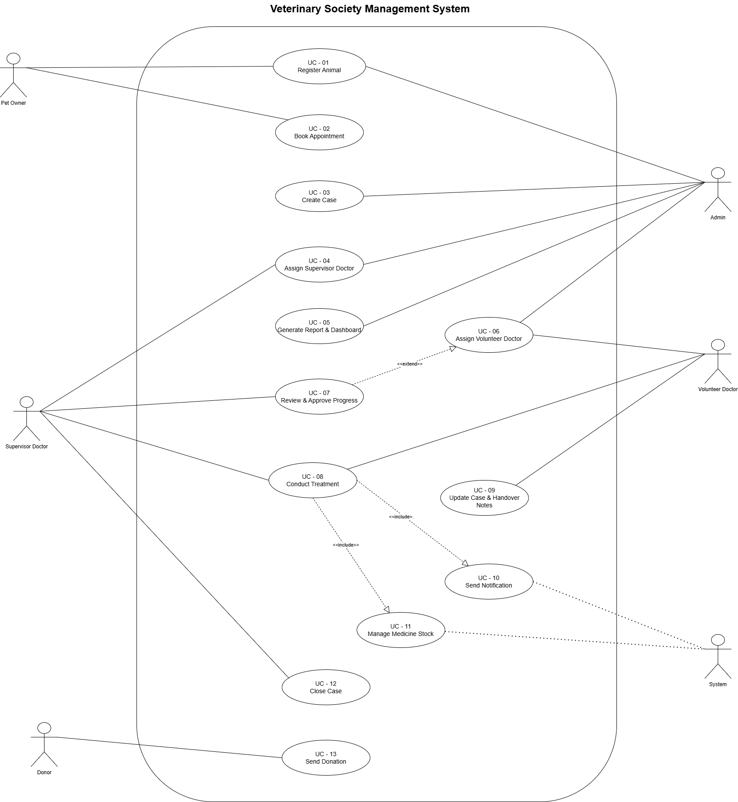
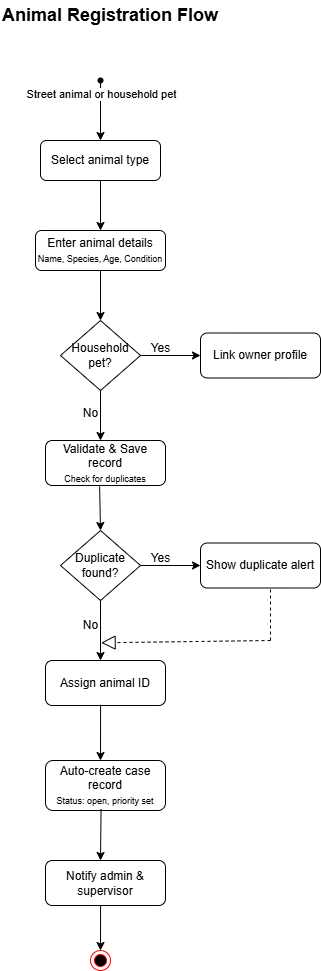
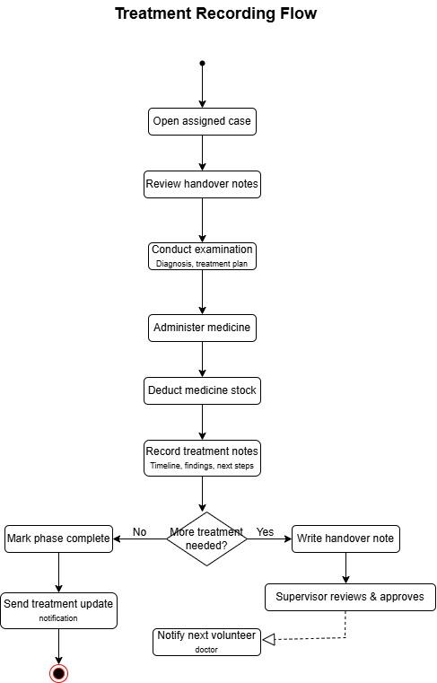
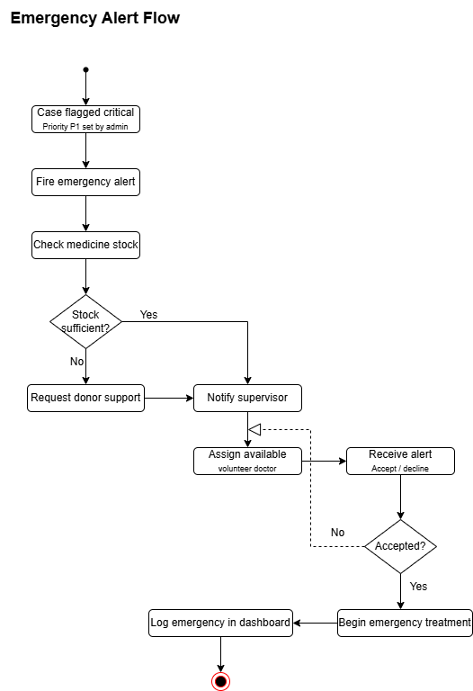
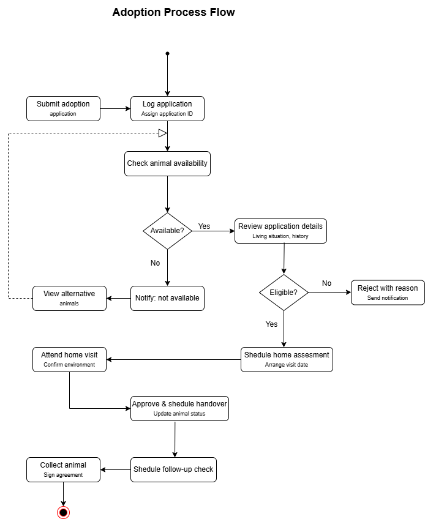
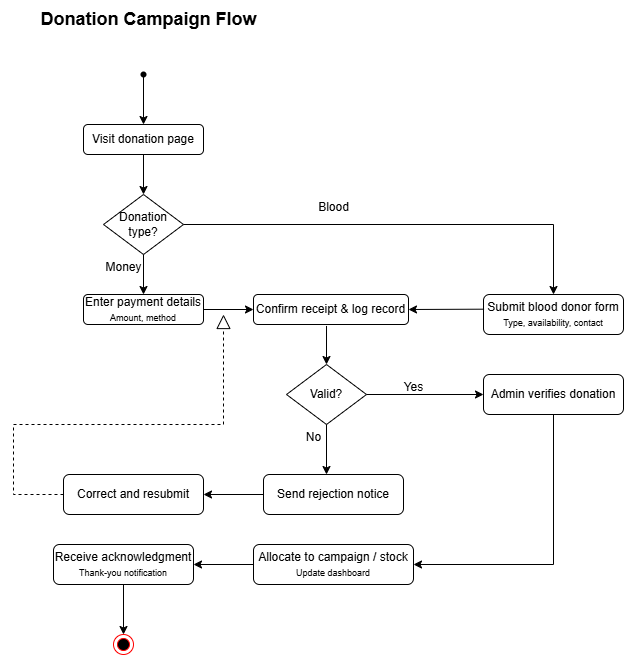

# Software Requirements Specification  
## Animal Ark 

### Project
Animal Ark 

### Client
Animal Ark, Volunteering Student Society  
Faculty of Veterinary Medicine and Animal Science  
University of Peradeniya

### Course
SENG 31242

### Document Type
Software Requirements Specification

### Version
Version 1.0 Draft

### Prepared By
Documentation Lead and Project Team

### Date
22.05.2026

## Document Metadata
| Field | Details |
|---|---|
| Document Name | Software Requirements Specification |
| Project Name | Animal Ark System |
| Version | 1.0 Draft |
| Status | Draft |
| Prepared By | Documentation Lead |
| Reviewed By | Project Team |
| Repository | Documents Repository |
| Last Updated | 22.05.2026 |

## Revision History

| Version | Date | Author | Description |
|---|---|---|---|
| 1.0 | 22.05.2026 | Documentation Lead | Initial SRS draft structure created |

## Table of Contents

1. Introduction  
2. Overall Description  
3. System Analysis  
4. Functional Requirements  
5. Non-Functional Requirements  
6. Alternative Solutions and Feasibility Study  
7. Use Case Diagrams  
8. Activity Diagrams  
9. Requirements Traceability  
10. References  

# 1. Introduction

## 1.1 Purpose
This section will describe the purpose of the Software Requirements Specification document for the Animal Ark System.

## 1.2 Scope
This section will describe the scope of the Animal Ark System, including animal rescue, treatment tracking, emergency support, adoption, donations, and medicine stock management.

## 1.3 Intended Audience
This section will identify the intended readers of the SRS, including the project team, course evaluators, Animal Ark representatives, developers, testers, and stakeholders.

## 1.4 Definitions, Acronyms and Abbreviations
| Term | Description |
|---|---|
| SRS | Software Requirements Specification |
| FR | Functional Requirement |
| NFR | Non-Functional Requirement |
| PWA | Progressive Web Application |

---

# 2. Overall Description

## 2.1 Product Perspective
This section will describe the Animal Ark System as a centralized digital platform for supporting Animal Ark’s animal welfare activities.

## 2.2 Product Functions
This section will summarize the main functions of the system.

Placeholder functions:
- User management
- Animal case management
- Treatment timeline management
- Emergency alert handling
- Adoption management
- Donation management
- Medicine stock management
- Volunteer statistics

## 2.3 User Classes and Characteristics

### Persona 1: Sawmi Jayasinghe , Volunteer Vet Student

**Role:** A veterinary student volunteer who participates in animal rescue, treatment, follow-up care, and shift-based updates.

**Goals:**
- Record treatment details clearly during or after each shift.
- Access previous treatment history of animals.
- Receive emergency updates quickly.
- Coordinate responsibilities with other volunteers.

**Pain Points:**
- Treatment updates are scattered across WhatsApp messages and paper notes.
- Handover details may be incomplete or missed.
- Difficult to know the latest condition of an animal.
- Medicine availability is not always clear.

**System Needs:**
- Animal profile with treatment history.
- Shift handover notes.
- Emergency alert and update feature.
- Medicine stock visibility.

**Expected Benefits:**
- Better continuity of animal care.
- Reduced missed treatment information.
- Faster coordination during emergencies.

### Persona 2: Supervisor Doctor

**Role:** A supervising veterinary doctor who guides students and monitors treatment decisions.

**Goals:**
- Review animal treatment progress.
- Guide volunteers on proper treatment actions.
- Monitor urgent cases and follow-up requirements.
- Ensure treatment records are accurate.

**Pain Points:**
- Difficult to track treatment decisions from informal messages.
- Important case updates may be delayed.
- Previous medical history may not be easy to find.
- Follow-up responsibility is not always clear.

**System Needs:**
- Searchable treatment records.
- Case status tracking.
- Ability to review and comment on animal records.
- Emergency case visibility.

**Expected Benefits:**
- Improved clinical decision-making.
- Better supervision of volunteer work.
- More reliable treatment continuity.

### Persona 3: Dahami Wataketiya, Society Committee Admin

**Role:** A committee member responsible for managing Animal Ark operations, volunteers, donations, adoption posts, and records.

**Goals:**
- Organize animal rescue and treatment activities.
- Maintain accurate animal, volunteer, donation, and adoption records.
- Coordinate announcements and campaigns.
- Track medicine and resource availability.

**Pain Points:**
- Records are distributed across paper notes, spreadsheets, and WhatsApp chats.
- Donation and adoption information may be difficult to track.
- Volunteer contribution records are not centralized.
- Medicine stock uncertainty affects planning.

**System Needs:**
- Central dashboard for animals, volunteers, donations, and adoptions.
- Medicine stock management.
- Adoption request tracking.
- Volunteer activity tracking.

**Expected Benefits:**
- Easier administration.
- Better transparency in donations and adoptions.
- Improved planning and accountability.

### Persona 4: Pabasara Gunasekara,  Donor / Public User

**Role:** A member of the public who supports Animal Ark through donations, adoption interest, awareness sharing, or volunteer support.

**Goals:**
- Learn about animals needing help.
- Donate to verified needs or campaigns.
- Request adoption information.
- Follow Animal Ark activities and impact.

**Pain Points:**
- Limited visibility into current donation needs.
- Adoption information may be shared informally.
- Difficult to know the status of rescued animals.
- Communication may depend on social media or individual contacts.

**System Needs:**
- Public animal/adoption listings.
- Donation campaign information.
- Simple adoption request form.
- Updates about Animal Ark activities.

**Expected Benefits:**
- Easier public engagement.
- Increased trust and transparency.
- Faster adoption and donation support.

## 2.4 Operating Environment
This section will describe the expected operating environment, including web browsers, mobile devices, and desktop devices.

## 2.5 Assumptions and Dependencies
This section will list assumptions and dependencies related to internet access, user availability, hosting services, and notification services.

---

# 3. System Analysis

## 3.1 Existing System Analysis
This section will describe the current manual or informal process used by Animal Ark.

## 3.2 Problems Identified
Placeholder problems:
- Treatment records are not centralized.
- Handover information may be missed between volunteers.
- Emergency alerts are difficult to coordinate quickly.
- Donation and adoption details are handled informally.
- Medicine stock is difficult to monitor manually.

## 3.3 Proposed System
This section will describe the proposed Animal Ark System and how it solves the identified problems.

## 3.4 Stakeholder Analysis
| Stakeholder | Interest / Responsibility |
|---|---|
| Animal Ark Society | Uses the system to manage animal welfare activities |
| Volunteer Students | Record rescue, treatment, and handover information |
| Supervisor Doctors | Monitor cases and guide treatment decisions |
| Donors | Support animal welfare campaigns |
| Adopters | Request adoption of recovered animals |
| Public Users | View awareness content and support activities |

## 3.5 Requirement Prioritization
This section will include requirement prioritization using methods such as MoSCoW.

Placeholder:
| Requirement Area | Priority |
|---|---|
| Animal case management | Must Have |
| Treatment timeline | Must Have |
| Emergency alerts | Must Have |
| Adoption management | Should Have |
| Donation management | Should Have |
| Volunteer statistics | Could Have |

---

# 4. Functional Requirements

This section will list the functional requirements of the Animal Ark System.

| Requirement ID | Functional Requirement | Priority |
|---|---|---|
| FR-01 | The system shall allow authorized users to log in securely. | Must Have |
| FR-02 | The system shall allow volunteers to admit emergency animals. | Must Have |
| FR-03 | The system shall allow volunteers to record treatment updates. | Must Have |
| FR-04 | The system shall allow volunteers to add shift handover notes. | Must Have |
| FR-05 | The system shall allow supervisor doctors to view assigned animal cases. | Must Have |
| FR-06 | The system shall allow supervisor doctors to close animal cases. | Must Have |
| FR-07 | The system shall allow emergency alerts to be sent to volunteers. | Must Have |
| FR-08 | The system shall allow adoption posts to be created and managed. | Should Have |
| FR-09 | The system shall allow donation campaigns to be created and displayed. | Should Have |
| FR-10 | The system shall allow medicine stock details to be managed. | Should Have |

---

# 5. Non-Functional Requirements

This section will describe the quality attributes and constraints of the Animal Ark System.

| Requirement ID | Non-Functional Requirement | Category |
|---|---|---|
| NFR-01 | The system shall provide secure authentication. | Security |
| NFR-02 | The system shall support role-based access control. | Security |
| NFR-03 | The system shall be responsive on mobile, tablet, and desktop devices. | Usability |
| NFR-04 | The system shall be easy to use for volunteer veterinary students. | Usability |
| NFR-05 | The system shall maintain accurate treatment history. | Reliability |
| NFR-06 | The system shall support push notifications for emergency alerts. | Performance |
| NFR-07 | The system shall protect sensitive user and animal case data. | Security |
| NFR-08 | The system shall be maintainable for future improvements. | Maintainability |

---

# 6. Alternative Solutions and Feasibility Study

## 6.1 Alternative Solutions

| Alternative | Description | Limitations |
|---|---|---|
| Continue manual records and WhatsApp communication | Animal Ark continues using existing informal methods | Information can be missed, difficult to track history |
| Use a generic management tool | Use tools such as spreadsheets or task management software | Not customized for animal treatment, adoption, donations, and emergencies |
| Develop a dedicated Animal Ark System | Build a custom system for Animal Ark activities | Requires development time and technical maintenance |

## 6.2 Technical Feasibility
This section will explain whether the proposed system can be developed using the selected technologies.

## 6.3 Operational Feasibility
This section will explain whether Animal Ark members and users can practically use the system.

## 6.4 Economic Feasibility
This section will explain whether the project can be completed within available resources.

## 6.5 Schedule Feasibility
This section will explain whether the project can be completed within the course timeline.

## 6.6 Recommended Solution
This section will justify why developing a dedicated Animal Ark System is the recommended solution.

---

# 7. Use Case Diagrams

This section will include the use case diagram of the Animal Ark System.

# 8. Activity Diagrams

This section includes activity diagrams for the major workflows of the Animal Ark System.

## 8.1 Animal Registration Flow

## 8.2 Treatment Recording Flow

## 8.3 Emergency Alert Flow

## 8.4 Adoption Process Flow

## 8.5 Donation Campaign Flow

 # 9. Requirements Traceability

This section will map functional requirements to related use cases and modules.

| Requirement ID | Requirement                   | Related Use Case          | Module                    |
| -------------- | ----------------------------- | ------------------------- | ------------------------- |
| FR-01          | Secure login                  | Login                     | User Management           |
| FR-02          | Admit emergency animal        | Admit Emergency Animal    | Animal Case Management    |
| FR-03          | Record treatment updates      | Record Treatment Update   | Treatment Timeline        |
| FR-04          | Add shift handover notes      | Add Handover Note         | Treatment Timeline        |
| FR-05          | View assigned animal cases    | View Animal Case          | Supervisor Oversight      |
| FR-06          | Close animal cases            | Close Animal Case         | Supervisor Oversight      |
| FR-07          | Send emergency alerts         | Receive Emergency Alert   | Emergency Management      |
| FR-08          | Manage adoption posts         | Manage Adoption Posts     | Adoption Management       |
| FR-09          | Manage donation campaigns     | Manage Donation Campaigns | Donation Management       |
| FR-10          | Manage medicine stock details | Manage Medicine Stock     | Medicine Stock Management |

# 10. References

This section will list the references used to prepare the SRS document.

Placeholder references:

SENG 31242 course guideline
Client discussion notes with Animal Ark representatives
Survey responses collected from stakeholders
IEEE Software Requirements Specification references 