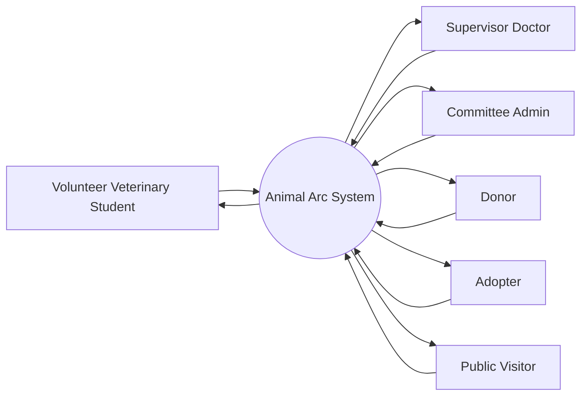

# Software Requirements Specification (SRS)

**Project:** Animal Arc  
**Client / Beneficiary:** Animal Ark, Faculty of Veterinary Medicine and Animal Science, University of Peradeniya  
**Group:** Logic Lords (Group 6)  
**Student Numbers:** SE/2022/021, SE/2022/028, SE/2022/033, SE/2022/050  
**Course:** SENG 31242 - System Design Project  
**Document Status:** Final / Baselined after supervisor review  
**Version:** 1.0  
**Last Updated:** 2026-06-12

---

## Document Control

| Version | Date | Author / Team | Change Summary | Status |
|---|---|---|---|---|
| 0.1 | 2026-05-24 | Logic Lords | Initial SRS draft created from requirements findings. | Draft |
| 0.2 | 2026-06-08 | Logic Lords | Functional requirements, use cases, diagrams, and NFRs refined. | Review Draft |
| 1.0 | 2026-06-12 | Logic Lords | Supervisor review finalisation: cross-checked FR/UC references, added version history, finalised traceability, and prepared Markdown source for repository baseline. | Final |

## Supervisor Review Resolution Summary

| Review Item | Resolution | Evidence / Location |
|---|---|---|
| Review all supervisor feedback comments | Feedback items were reviewed and reflected in the final SRS baseline. Add specific supervisor comment IDs here if available. | This SRS v1.0 |
| Update functional and non-functional requirements consistently | FR-01 to FR-20 and NFR sections were checked for consistent wording, priority, source, and verification method. | Sections 4 and 5 |
| Cross-check use cases, diagrams, and requirement references | UC-01 to UC-13 were mapped to FRs, test cases, and diagram references. | Sections 3 and 6 |
| Update SRS version number and change log | Version history and final baseline status were added. | Document Control |
| Commit final source and PDF | Markdown source should be committed as `documents/srs/srs.md`; exported PDF should be committed as `documents/srs/srs.pdf`. | Repository action required |

---

## Table of Contents

1. [Introduction](#1-introduction)
2. [Overall Description](#2-overall-description)
3. [System Analysis](#3-system-analysis)
4. [Functional Requirements](#4-functional-requirements)
5. [Non-Functional Requirements](#5-non-functional-requirements)
6. [Requirement Traceability Matrix](#6-requirement-traceability-matrix)
7. [Alternative Solutions and Feasibility Study](#7-alternative-solutions-and-feasibility-study)
8. [Appendix A: Repository File Checklist](#appendix-a-repository-file-checklist)

---

# 1. Introduction

## 1.1 Purpose and Scope

### Purpose

The purpose of this Software Requirements Specification (SRS) is to define the functional and non-functional requirements for the Animal Arc system. Animal Arc is designed as a digital animal welfare management platform for Animal Ark, the student-led animal welfare society of the Faculty of Veterinary Medicine and Animal Science, University of Peradeniya.

The main goal of the system is to improve how Animal Ark manages rescued animals, treatment records, emergency cases, medicine stock, donations, blood donor information, adoption activities, volunteer contributions, and public engagement.

### Scope

The Animal Arc system will provide a centralised platform for volunteer veterinary students, supervisor doctors, society committee members, donors, adopters, and members of the public. The system will support internal animal-care workflows and external public-facing interactions.

The core capabilities of the system include:

- **Animal Intake:** Register rescued animals with rescue details, photos, location, condition, and initial notes.
- **Treatment Timeline:** Maintain chronological treatment history including medicines, procedures, observations, and recovery progress.
- **Handover Notes:** Support shift-to-shift communication using important notes and pending actions.
- **Supervisor Oversight:** Allow supervisor doctors to review cases, approve treatment decisions, and monitor critical animals.
- **Case Closure:** Close animal cases after recovery, death, adoption, transfer, or release.
- **Emergency Alerts:** Notify relevant volunteers and supervisors about urgent rescue or treatment situations.
- **Medicine Stock Management:** Track medicine inventory, stock levels, and low-stock situations.
- **Donation Management:** Record donation campaigns, donor contributions, and donation usage.
- **Blood Donor Registration:** Maintain a searchable animal blood donor registry for emergency transfusion support.
- **Adoption Flow:** Manage adoption listings, applications, screening, approval, and completion.
- **Volunteer Statistics:** Record volunteer involvement, case participation, and contribution statistics.
- **Public Portal:** Provide public access to adoption listings, donation campaigns, awareness posts, and contact information.

### Out of Scope

The current version will not include advanced hospital billing, online payment gateway integration, full veterinary hospital management, government animal registration, laboratory equipment integration, or AI-based diagnosis.

## 1.2 Definitions, Acronyms, and Abbreviations

| Term | Definition |
|---|---|
| Animal Ark | Student-led animal welfare society at the Faculty of Veterinary Medicine and Animal Science, University of Peradeniya. |
| Animal Arc | Proposed software system developed to support Animal Ark rescue, treatment, adoption, donation, and volunteer management workflows. |
| SRS | Software Requirements Specification. |
| Volunteer | Veterinary student or authorised society member participating in rescue, treatment support, handovers, and follow-up care. |
| Supervisor Doctor | Veterinary doctor or authorised supervisor who reviews animal cases and provides treatment guidance. |
| Committee Admin | Society committee member responsible for user access, campaigns, medicine stock, adoption flow, and records. |
| Animal Intake | Process of registering a newly rescued animal into the system. |
| Treatment Timeline | Chronological record of treatment updates, medicines, observations, and progress notes. |
| Handover Notes | Shift-change notes used to maintain treatment continuity. |
| Emergency Alert | System notification used to inform responsible users about urgent rescue or treatment situations. |
| Medicine Stock | Inventory of medicines and medical supplies used by Animal Ark. |
| Blood Donor | Registered animal that may be contacted for blood donation during emergency transfusion cases. |
| Adopter | Member of the public who applies to adopt an animal listed by Animal Ark. |

## 1.3 References

- Stakeholder Interview Summary 01
- Stakeholder Interview Summary 02
- Volunteer Survey Findings
- Existing WhatsApp and Paper-Based Workflow Analysis
- Existing System Analysis with Pain Points
- Use Case Descriptions in `docs/srs/use-cases/`
- Activity Diagrams in `docs/srs/diagrams/`
- SENG 31242 System Design Project Guidelines

## 1.4 Overview of Document

The remainder of this document is structured as follows:

- **Section 2:** Overall Description
- **Section 3:** System Analysis
- **Section 4:** Functional Requirements
- **Section 5:** Non-Functional Requirements
- **Section 6:** Requirement Traceability Matrix
- **Section 7:** Alternative Solutions and Feasibility Study

---

# 2. Overall Description

## 2.1 Product Perspective

Animal Arc is a web-based and mobile-responsive software system designed to support Animal Ark animal welfare operations. It replaces the current fragmented workflow that depends on WhatsApp messages, paper records, informal social media posts, and manually maintained donation or medicine records.

The system will act as a centralised platform where internal users can manage animal records, treatment updates, handovers, emergency alerts, donations, medicine stock, blood donors, adoption processes, and volunteer statistics. Public users will interact through a public portal that displays adoption animals, donation campaigns, awareness content, and contact information.

The main system components are:

- Internal dashboard for volunteers, supervisors, and committee admins
- Animal profile and treatment management module
- Emergency alert and notification module
- Medicine stock management module
- Donation and campaign management module
- Blood donor registry module
- Adoption management module
- Volunteer statistics module
- Public portal for donors, adopters, and visitors

### 2.1.1 Context Diagram

## 2.2 User Classes and Characteristics

### 2.2.1 Volunteer Veterinary Student

Volunteer veterinary students are the primary operational users. They participate in rescue, treatment updates, daily care, and handover communication. They require a simple and fast interface because they may use the system during busy clinical or rescue activities.

Main needs:

- Register rescued animals
- Update treatment progress
- Add handover notes
- Respond to emergency alerts
- View assigned or active animal cases
- Track personal volunteer contribution statistics

### 2.2.2 Supervisor Doctor

Supervisor doctors review animal cases, monitor critical animals, guide treatment decisions, and approve important case updates. They require accurate case histories and clear treatment timelines.

Main needs:

- Review treatment records
- Provide medical instructions
- Approve or reject case closure
- Monitor emergency cases
- View volunteer updates and handover notes

### 2.2.3 Committee Admin

Committee admins manage society-level operations such as user access, medicine stock, donations, adoption applications, blood donor records, and public portal content.

Main needs:

- Manage user roles
- Manage medicine inventory
- Manage donation campaigns and records
- Manage adoption listings and applications
- View volunteer statistics
- Maintain public portal content

### 2.2.4 Donor

Donors are external users who support Animal Ark through money, medicines, food, or other resources. They require clear campaign information and transparency about donation needs.

### 2.2.5 Adopter

Adopters are public users who wish to adopt recovered animals. They need access to adoption listings and a clear application process.

### 2.2.6 Public Visitor

Public visitors include animal lovers, students, university staff, and community members who want to learn about Animal Ark and support its activities.

## 2.3 Operating Environment

- **Client Devices:** Desktop computers, laptops, tablets, and smartphones.
- **Web Browser Support:** Chrome, Edge, Firefox, and Safari.
- **Network Environment:** Normal internet access is assumed; mobile data may be used during rescue or treatment activities.
- **Server Environment:** Cloud-based or university-supported server environment.
- **Database:** Centralised database for animal profiles, treatment records, accounts, donations, stock, adoption applications, and blood donor details.
- **Media Storage:** Secure storage for animal photos, medical images, adoption photos, and donation proof images.

## 2.4 Design and Implementation Constraints

- The system must be simple enough for volunteers to use during busy rescue and treatment situations.
- The system must support role-based access for different user permissions.
- Sensitive donor, adopter, and treatment information must not be publicly exposed.
- The public portal must not allow unauthorised modification of internal records.
- The design must remain realistic within the SENG 31242 project timeline.
- The system must support image uploads where required.

## 2.5 Assumptions and Dependencies

- Volunteers and committee members have access to smartphones or computers with internet connectivity.
- Supervisor doctors will review important medical updates through the system when required.
- The society will define authorised users before deployment.
- Adoption approval decisions will be made by authorised Animal Ark members, not automatically by the system.
- Donation verification may require manual confirmation by committee admins.
- Medicine stock accuracy depends on accurate entry by authorised users.
- The system depends on stable hosting, database, and file storage services.

---

# 3. System Analysis

## 3.1 Fact-Gathering Techniques Used

### 3.1.1 Structured Interviews

Structured interviews were conducted with key stakeholders to understand Animal Ark's current workflow, problems, and expectations. The interviews focused on animal intake, treatment tracking, emergency handling, adoption, donations, medicine stock, and volunteer coordination.

### 3.1.2 Volunteer Survey

A survey questionnaire was prepared for volunteer veterinary students to collect structured feedback about treatment tracking, handover communication, emergency alerts, medicine stock awareness, adoption processes, and volunteer recognition.

### 3.1.3 Existing System Analysis

The existing WhatsApp and paper-based workflow was analysed to identify operational pain points.

### 3.1.4 Document and Record Analysis

Existing record formats, message patterns, adoption posts, donation tracking methods, and medicine stock practices were reviewed to identify required data fields and workflows.

## 3.2 Existing System Analysis

Animal Ark currently manages many activities through WhatsApp messages, paper notes, spreadsheets, social media posts, and verbal communication. These methods are familiar, but they become difficult to control when the number of animal cases, volunteers, donations, and adoption requests increases.

### 3.2.1 Current Workflow Summary

1. A rescued or injured animal is reported through a message, phone call, or direct contact.
2. Volunteers coordinate rescue and treatment through WhatsApp or verbal communication.
3. Treatment updates are shared informally through messages, photos, or handwritten notes.
4. Handover details are communicated manually.
5. Emergency situations are handled through urgent calls or WhatsApp messages.
6. Medicine stock is checked manually or by asking responsible members.
7. Donations are promoted through posts or messages and recorded manually.
8. Adoption posts are shared through social media or informal communication.
9. Volunteer contributions are not always recorded in a structured manner.

### 3.2.2 Key Pain Points Identified

- Missing or scattered treatment records
- Weak handover communication
- Emergency blind spots
- Medicine stock uncertainty
- Manual donation tracking
- Unstructured adoption flow
- Lack of searchable animal history
- Limited volunteer recognition
- Public engagement gaps

### 3.2.3 Proposed Improvement

Animal Arc will address these problems by providing one centralised system for animal profiles, treatment timelines, handovers, emergency alerts, medicine stock, donations, blood donors, adoptions, volunteer statistics, and public engagement.

## 3.3 Use Case Diagram

```mermaid
flowchart TB
    subgraph System[Animal Arc System]
        UC01[UC-01 Animal Intake]
        UC02[UC-02 Treatment Timeline]
        UC03[UC-03 Handover Notes]
        UC04[UC-04 Supervisor Review]
        UC05[UC-05 Case Closure]
        UC06[UC-06 Emergency Alerts]
        UC07[UC-07 Medicine Stock]
        UC08[UC-08 Donations]
        UC09[UC-09 Blood Donor Registry]
        UC10[UC-10 Adoption Flow]
        UC11[UC-11 Volunteer Statistics]
        UC12[UC-12 Public Portal]
        UC13[UC-13 Authentication & Roles]
    end
    Volunteer[Volunteer Veterinary Student] --- UC01
    Volunteer --- UC02
    Volunteer --- UC03
    Volunteer --- UC06
    Volunteer --- UC11
    Supervisor[Supervisor Doctor] --- UC02
    Supervisor --- UC04
    Supervisor --- UC05
    Supervisor --- UC09
    Admin[Committee Admin] --- UC05
    Admin --- UC07
    Admin --- UC08
    Admin --- UC10
    Admin --- UC13
    Donor[Donor] --- UC08
    Adopter[Adopter] --- UC10
    Public[Public Visitor] --- UC09
    Public --- UC12
```

## 3.4 Use Case Descriptions

### UC-01: Animal Intake and Profile Creation

| Field | Details |
|---|---|
| Use Case ID | UC-01 |
| Use Case Name | Animal Intake and Profile Creation |
| Actor(s) | Primary: Intake Staff / Volunteer Veterinary Student; Secondary: Committee Admin |
| Description | Allows an authorised staff member or volunteer to register a newly rescued or brought-in street animal by capturing intake details. |
| Preconditions | User is logged in with Intake Staff or Volunteer role; animal has been brought to the care centre or rescue location is known; system is accessible via browser or mobile device. |
| Postconditions | A new animal profile is created with a unique Animal ID; intake details are saved; status is set to Active – Awaiting Medical Case; profile is visible to authorised internal users. |

**Main Flow**

1. User selects Register New Animal from the dashboard.
2. System displays the Animal Intake Form.
3. User enters species, estimated age, sex, colour, identifying marks, condition, rescue/found location, bringer details, urgency level, photos, and initial notes.
4. User submits the intake form.
5. System validates required fields, generates a unique Animal ID, saves the profile, and displays confirmation.

**Alternative Flows**

- A1 Missing Required Fields: system highlights missing fields and returns the form.
- A2 Photo Upload Failure: system displays an error and allows re-upload or skipping photos.
- A3 Network Interruption: system retains entered data and prompts retry.

**Business Rules**

- Species, initial condition, and urgency level are mandatory.
- Each animal receives a unique system-generated Animal ID.
- Photos must not exceed 2 MB per image.
- Intake location must be recorded as map coordinates or text description.

### UC-02: Treatment Timeline Management

| Field | Details |
|---|---|
| Use Case ID | UC-02 |
| Use Case Name | Treatment Timeline Management |
| Actor(s) | Primary: Volunteer Veterinary Student; Secondary: Supervisor Doctor |
| Description | Allows assigned volunteers and supervisors to add, update, and view treatment timeline entries for an active medical case. |
| Preconditions | User is logged in with Volunteer Doctor or Supervisor Doctor role; an animal profile and medical case exist; case is Open or In Progress; volunteer is assigned where applicable. |
| Postconditions | Treatment entry is saved; medicine stock is reduced when medicine usage is recorded; last updated timestamp is refreshed; supervisor can view the entry. |

**Main Flow**

1. User opens assigned case list and selects an animal case.
2. System displays case profile and treatment timeline.
3. User selects Add Treatment Entry.
4. User enters treatment stage, diagnosis notes, observations, medicines used, quantities, supporting files, next action, and entry status.
5. System validates fields, saves the entry, adjusts medicine stock, and shows the updated timeline.

**Alternative Flows**

- A1 Missing Required Fields: system highlights missing treatment stage or notes.
- A2 Insufficient Medicine Stock: system warns and asks user to confirm or adjust quantity.
- A3 Case Already Closed: system prevents new entries.

**Business Rules**

- Treatment stage and notes are mandatory.
- Medicine usage must reference an existing stock item.
- Only assigned volunteer doctor or supervisor can add entries.
- Entries are timestamped and linked to the submitting doctor.
- Timeline entries cannot be deleted; corrections require a correction note.

### UC-03: Handover Notes Management

| Field | Details |
|---|---|
| Use Case ID | UC-03 |
| Use Case Name | Handover Notes Management |
| Actor(s) | Primary: Volunteer Veterinary Student; Secondary: Supervisor Doctor |
| Description | Allows volunteers to add handover notes to active cases for continuity between shifts. |
| Preconditions | User is logged in with Volunteer or Supervisor Doctor role; case is active and in progress; current shift volunteer is responsible for the case. |
| Postconditions | Handover note is saved, timestamped, attributed to the volunteer, and visible to incoming volunteers or supervisors. |

**Main Flow**

1. User opens an active animal case.
2. User selects Add Handover Note.
3. System displays the handover note form.
4. User enters current status, pending tasks, medicine reminders, feeding instructions, warnings, and observations.
5. System validates content, saves the note, and displays the updated notes list.

**Alternative Flows**

- A1 Empty Note Submission: system displays a validation message.
- A2 Case Closed: system prevents adding new notes.

**Business Rules**

- Note content must not be empty.
- Notes are read-only once submitted.
- Each note displays author and timestamp.
- Notes are visible in reverse chronological order.

### UC-04: Supervisor Oversight and Review

| Field | Details |
|---|---|
| Use Case ID | UC-04 |
| Use Case Name | Supervisor Oversight and Review |
| Actor(s) | Primary: Supervisor Doctor; Secondary: Volunteer Veterinary Student |
| Description | Allows supervisors to review cases, add medical instructions, assign/reassign volunteers, and approve or reject recovery decisions. |
| Preconditions | Supervisor is logged in; at least one active case exists; treatment entries have been submitted where applicable. |
| Postconditions | Supervisor comments are saved; assignment changes are recorded; volunteers are notified; recovery status may be updated. |

**Main Flow**

1. Supervisor opens Supervisor Dashboard.
2. System displays active cases with status and urgency.
3. Supervisor selects a case and reviews profile, timeline, and handover notes.
4. Supervisor adds comments/instructions and may assign or reassign a volunteer doctor.
5. System saves the review, updates assignments, notifies users, and updates recovery status where confirmed.

**Alternative Flows**

- A1 No Active Cases: system displays an empty state message.
- A2 Recovery Rejection: case remains In Progress with further instructions.
- A3 No Volunteer Doctor Available: system displays a message and keeps the case unassigned.

**Business Rules**

- Only Supervisor Doctor can approve recovery and assign doctors.
- Supervisor comments are timestamped and cannot be deleted.
- A case can have only one assigned volunteer doctor at a time.
- Recovery confirmation is required before adoption notice publication.

### UC-05: Case Closure

| Field | Details |
|---|---|
| Use Case ID | UC-05 |
| Use Case Name | Case Closure |
| Actor(s) | Primary: Supervisor Doctor; Secondary: Committee Admin |
| Description | Allows authorised users to formally close a case by selecting closure reason and recording final notes. |
| Preconditions | User is logged in with Supervisor Doctor or Committee Admin role; case is active or recovered; required timeline entries are complete; if adopted, approved adoption application exists. |
| Postconditions | Case status is Closed; reason, notes, and date are recorded; animal profile reflects outcome; related records become read-only and searchable. |

**Main Flow**

1. User opens animal case and selects Close Case.
2. System displays closure form.
3. User selects closure reason and enters final notes.
4. User confirms closure.
5. System validates reason, updates case and animal status, records date, and displays confirmation.

**Alternative Flows**

- A1 Missing Closure Reason: system prevents closure.
- A2 Pending Adoption Application: system requires adoption confirmation.
- A3 Critical Open Timeline Items: system warns before proceeding.

**Business Rules**

- Closure reason is mandatory.
- Closed cases cannot receive new treatment entries.
- Closed cases remain as read-only historical records.
- Closure archives related handover notes and timeline entries.

### UC-06: Emergency Alert Management

| Field | Details |
|---|---|
| Use Case ID | UC-06 |
| Use Case Name | Emergency Alert Management |
| Actor(s) | Primary: Volunteer Veterinary Student / Committee Admin; Secondary: Supervisor Doctor |
| Description | Allows authorised users to create and broadcast emergency alerts for urgent rescue or treatment situations. |
| Preconditions | User is logged in with Volunteer or Committee Admin role; an urgent situation exists; notification service is operational. |
| Postconditions | Alert is created with Open status; relevant users are notified; responses and status changes are tracked. |

**Main Flow**

1. User selects Create Emergency Alert.
2. System displays emergency alert form.
3. User enters emergency type, description, location, required support, and related case if applicable.
4. System validates fields, creates alert, broadcasts notification, and displays it on dashboards.
5. Responding users acknowledge and update status until resolved or cancelled.

**Alternative Flows**

- A1 Missing Emergency Type or Description: system returns form with validation errors.
- A2 No Users to Notify: system still creates the dashboard alert.
- A3 Alert Cancelled: creator records a cancellation note.

**Business Rules**

- Emergency type and description are mandatory.
- Only alert creator or Committee Admin can cancel/close an alert.
- Status sequence: Open → Assigned → In Progress → Resolved / Cancelled.
- Resolved alerts remain in the emergency log.

### UC-07: Medicine Stock Management

| Field | Details |
|---|---|
| Use Case ID | UC-07 |
| Use Case Name | Medicine Stock Management |
| Actor(s) | Primary: Committee Admin; Secondary: Volunteer Doctor / Supervisor Doctor |
| Description | Allows committee admins to manage medicine inventory and supports low-stock alerts. |
| Preconditions | Admin is logged in for stock changes; medicine name, quantity, and unit are available; minimum threshold is defined for low-stock alerts. |
| Postconditions | Medicine record is created/updated; treatment usage reduces quantities; low-stock notifications are sent; stock changes are logged. |

**Main Flow**

1. Admin opens Medicine Inventory.
2. System displays stock list.
3. Admin selects Add New Medicine and enters medicine details, expiry, storage notes, and minimum threshold.
4. System validates and saves the record.
5. When treatment usage is recorded, system reduces stock and triggers low-stock alert when threshold is reached.

**Alternative Flows**

- A1 Duplicate Medicine Name: system prompts update of existing record.
- A2 Expired Medicine: system highlights expired items for review.
- A3 Treatment Usage Exceeds Stock: system warns user.

**Business Rules**

- Medicine name, quantity, and unit are mandatory.
- Only Committee Admin can add/edit/remove stock records.
- Every stock change is logged with user, action, and timestamp.
- Quantity at or below threshold triggers low-stock alert.

### UC-08: Donation Campaign and Donation Record Management

| Field | Details |
|---|---|
| Use Case ID | UC-08 |
| Use Case Name | Donation Campaign and Donation Record Management |
| Actor(s) | Primary: Committee Admin; Secondary: Donor / Public User |
| Description | Allows admins to create donation campaigns and record donations linked to campaigns or general support. |
| Preconditions | Committee Admin is logged in; donation need has been identified; public portal is accessible for donor submissions. |
| Postconditions | Campaign is visible on the portal; received donations are recorded; campaign progress is updated; records store donor details and proof where provided. |

**Main Flow**

1. Admin creates donation campaign with title, description, target, deadline, related animal case, and status.
2. System validates and publishes active campaign.
3. Donor views campaign and submits donation interest/details.
4. Admin records received donation with donor name, contact, type, amount/item, date, and proof.
5. System updates campaign summary and admin closes the campaign when appropriate.

**Alternative Flows**

- A1 Missing Campaign Fields: system returns form.
- A2 Donation Submitted Outside System: admin records it as a general donation.
- A3 Target Met: system notifies admin and supports status update to Target Met.

**Business Rules**

- Campaign title and description are mandatory.
- Only Committee Admin can create/edit/close campaigns.
- Each donation record must include donor name, donation type, and date.
- Campaign statuses: Active, Target Met, Closed.

### UC-09: Blood Donor Registration and Search

| Field | Details |
|---|---|
| Use Case ID | UC-09 |
| Use Case Name | Blood Donor Registration and Search |
| Actor(s) | Primary: Public Visitor / Animal Owner; Secondary: Volunteer Doctor / Supervisor Doctor |
| Description | Allows animal owners to register animal blood donors and authorised doctors to search the donor registry during emergencies. |
| Preconditions | Registrant has animal and owner details; doctor is logged in for search; transfusion need exists. |
| Postconditions | Donor record is saved and searchable by authorised users; matching results and contact details are available to doctors. |

**Main Flow**

1. Owner opens blood donor registration form.
2. Owner enters animal details, owner contact, location, blood type if known, and availability.
3. System validates and saves donor record.
4. Doctor opens Blood Donor Search and enters species, location, blood type, and availability filters.
5. System displays matching donors and authorised contact details.

**Alternative Flows**

- A1 No Matching Donors: system displays no-results message and suggests broader search.
- A2 Incomplete Registration: system returns highlighted errors.

**Business Rules**

- Animal species, owner contact, and location are mandatory.
- Donor records can be updated or deactivated by owner or admin.
- Only logged-in volunteers and supervisors can view full donor contact details.
- Public users can register but cannot view the registry.

### UC-10: Adoption Flow Management

| Field | Details |
|---|---|
| Use Case ID | UC-10 |
| Use Case Name | Adoption Flow Management |
| Actor(s) | Primary: Committee Admin / Supervisor Doctor; Secondary: Adopter / Public User |
| Description | Covers creating adoption listings, accepting public applications, reviewing, approving, and completing adoption flow. |
| Preconditions | Animal is recovered and confirmed by supervisor for listing; portal listing is published for public applications; admin is logged in for review. |
| Postconditions | Listing is visible; application is saved and linked; application status is updated; approved application makes case eligible for closure as Adopted. |

**Main Flow**

1. Supervisor confirms recovery and marks animal Ready for Adoption.
2. Admin creates adoption listing with animal description, health status, temperament, requirements, and photos.
3. System publishes listing to public portal.
4. Adopter submits application with personal, contact, home, and adoption reason details.
5. Admin reviews and approves or rejects application; system updates status and notifies adopter.

**Alternative Flows**

- A1 Animal Not Recovered: listing creation is disabled.
- A2 Incomplete Application: system returns form.
- A3 Multiple Applications: only one can be approved; others become Unsuccessful.
- A4 Listing Withdrawn: admin unpublishes listing.

**Business Rules**

- Listing can be created only after supervisor recovery confirmation.
- At least one photo is required for listing.
- Approval requires Committee Admin authorisation.
- Application statuses: Under Review, Approved, Rejected, Unsuccessful.

### UC-11: Volunteer Statistics Tracking

| Field | Details |
|---|---|
| Use Case ID | UC-11 |
| Use Case Name | Volunteer Statistics Tracking |
| Actor(s) | Primary: Volunteer Veterinary Student; Secondary: Committee Admin / Supervisor Doctor |
| Description | Automatically tracks and displays volunteer contribution statistics from system activity. |
| Preconditions | Volunteer is logged in; activity records exist or statistics module is enabled. |
| Postconditions | Statistics are calculated accurately; volunteers view own statistics; supervisors/admins view summary across volunteers. |

**Main Flow**

1. Volunteer opens My Statistics.
2. System retrieves activity records linked to the volunteer.
3. System calculates cases handled, treatment entries, handover notes, emergency responses, and adoption support.
4. Volunteer views summary and breakdown.
5. Admin or supervisor views filtered overview across volunteers.

**Alternative Flows**

- A1 No Activity Yet: system displays zero counts with a message.
- A2 Admin View: admin filters by date range, case type, or volunteer.

**Business Rules**

- Statistics are calculated automatically from activity logs.
- Manual editing is not permitted.
- Volunteers can see only their own statistics.
- Supervisors and admins can see all volunteer statistics.

### UC-12: Public Portal Access

| Field | Details |
|---|---|
| Use Case ID | UC-12 |
| Use Case Name | Public Portal Access |
| Actor(s) | Primary: Public Visitor; Secondary: Donor / Adopter |
| Description | Allows public users to browse Animal Arc public portal without login and submit public-facing forms. |
| Preconditions | Portal is accessible through a browser; public content is published where available; no login is required for browsing. |
| Postconditions | Public content is viewed; submitted inquiries, donation interests, donor registrations, or adoption applications are saved; internal records remain protected. |

**Main Flow**

1. Public user opens portal URL.
2. System displays home page with listings, campaigns, and awareness content.
3. User browses adoption listings or donation campaigns.
4. User submits adoption application, donation inquiry, blood donor registration, or general inquiry.
5. System confirms submission and notifies admin where applicable.

**Alternative Flows**

- A1 No Listings Available: system shows no-items message.
- A2 Submission Failure: system retains form data and prompts retry.
- A3 Internal Page Access Attempt: system redirects to login page.

**Business Rules**

- Portal must not expose internal treatment records, volunteer details, or private contact information.
- Public users cannot modify internal records.
- Adoption applications are saved as Under Review.
- All public submissions are visible to Committee Admin for follow-up.

### UC-13: User Authentication and Role Management

| Field | Details |
|---|---|
| Use Case ID | UC-13 |
| Use Case Name | User Authentication and Role Management |
| Actor(s) | Primary: Committee Admin; Secondary: All Internal Users |
| Description | Covers secure login, logout, role-based access control, user registration, role assignment, and account activation/deactivation. |
| Preconditions | A registered account exists for login; Committee Admin is logged in for user management; JWT authentication service is operational. |
| Postconditions | Authenticated users access role-allowed features; new accounts are created and assigned roles; deactivated accounts cannot log in; login attempts are logged. |

**Main Flow**

1. User opens login page and enters email/password.
2. System validates credentials, generates JWT token, establishes session, and redirects user to role-specific dashboard.
3. Admin opens User Management, views users, adds a new user with name/email/phone/role, or updates/deactivates existing user.
4. System saves changes and applies role changes immediately.

**Alternative Flows**

- A1 Incorrect Credentials: system displays error; after 5 failures account is temporarily locked.
- A2 Deactivated Account: system shows Account Inactive message.
- A3 Duplicate Email: system prevents new account creation.

**Business Rules**

- Passwords must be stored as hashed values.
- Each user must have exactly one role.
- Only Committee Admin can create/update/deactivate user accounts.
- JWT tokens expire after a defined period and require re-authentication.
- Role changes take effect immediately.

## 3.5 Activity Diagrams

The following activity diagrams must be committed as editable source files and exported images. The Markdown file can reference the PNG/SVG exports after they are added to the repository.

| Diagram ID | Workflow | Source File | Export File | Related UC |
|---|---|---|---|---|
| ACT-01 | Animal Intake Flow | `docs/srs/diagrams/animal-intake-flow.drawio` | `docs/srs/diagrams/animal-intake-flow.png` | UC-01 |
| ACT-02 | Treatment Timeline Flow | `docs/srs/diagrams/treatment-timeline-flow.drawio` | `docs/srs/diagrams/treatment-timeline-flow.png` | UC-02 |
| ACT-03 | Handover Notes Flow | `docs/srs/diagrams/handover-notes-flow.drawio` | `docs/srs/diagrams/handover-notes-flow.png` | UC-03 |
| ACT-04 | Emergency Alert Flow | `docs/srs/diagrams/emergency-alert-flow.drawio` | `docs/srs/diagrams/emergency-alert-flow.png` | UC-06 |
| ACT-05 | Medicine Stock Flow | `docs/srs/diagrams/medicine-stock-flow.drawio` | `docs/srs/diagrams/medicine-stock-flow.png` | UC-07 |
| ACT-06 | Donation Campaign Flow | `docs/srs/diagrams/donation-campaign-flow.drawio` | `docs/srs/diagrams/donation-campaign-flow.png` | UC-08 |
| ACT-07 | Blood Donor Registration Flow | `docs/srs/diagrams/blood-donor-registration-flow.drawio` | `docs/srs/diagrams/blood-donor-registration-flow.png` | UC-09 |
| ACT-08 | Adoption Process Flow | `docs/srs/diagrams/adoption-process-flow.drawio` | `docs/srs/diagrams/adoption-process-flow.png` | UC-10 |
| ACT-09 | Case Closure Flow | `docs/srs/diagrams/case-closure-flow.drawio` | `docs/srs/diagrams/case-closure-flow.png` | UC-05 |
| ACT-10 | Public Portal Flow | `docs/srs/diagrams/public-portal-flow.drawio` | `docs/srs/diagrams/public-portal-flow.png` | UC-12 |

## 3.6 System Sequence Diagrams

High-level system sequence diagrams should be prepared for all main use cases to show interaction between actors and the Animal Arc system.

| Sequence Diagram | Related Use Case | Recommended File Name |
|---|---|---|
| SD-01 Animal Intake and Profile Creation | UC-01 | `sd-01-animal-intake.puml` / `.png` |
| SD-02 Treatment Timeline Management | UC-02 | `sd-02-treatment-timeline.puml` / `.png` |
| SD-03 Handover Notes Management | UC-03 | `sd-03-handover-notes.puml` / `.png` |
| SD-04 Supervisor Oversight and Review | UC-04 | `sd-04-supervisor-review.puml` / `.png` |
| SD-05 Case Closure | UC-05 | `sd-05-case-closure.puml` / `.png` |
| SD-06 Emergency Alert Management | UC-06 | `sd-06-emergency-alert.puml` / `.png` |
| SD-07 Medicine Stock Management | UC-07 | `sd-07-medicine-stock.puml` / `.png` |
| SD-08 Donation Campaign and Donation Record Management | UC-08 | `sd-08-donations.puml` / `.png` |
| SD-09 Blood Donor Registration and Search | UC-09 | `sd-09-blood-donor.puml` / `.png` |
| SD-10 Adoption Flow Management | UC-10 | `sd-10-adoption-flow.puml` / `.png` |
| SD-11 Volunteer Statistics Tracking | UC-11 | `sd-11-volunteer-statistics.puml` / `.png` |
| SD-12 Public Portal Access | UC-12 | `sd-12-public-portal.puml` / `.png` |
| SD-13 User Authentication and Role Management | UC-13 | `sd-13-auth-role-management.puml` / `.png` |

---

# 4. Functional Requirements

The functional requirements are prioritised using MoSCoW prioritisation: MUST, SHOULD, and COULD.

## FR-01: Animal Intake and Profile Creation

| Field | Details |
|---|---|
| ID | FR-01 |
| Title | Animal Intake and Profile Creation |
| Description | The system shall allow an authorised volunteer to create a new animal profile by entering rescue details, species, approximate age, sex, condition, rescue location, photos, and initial notes. |
| Priority | MUST |
| Source | Stakeholder interview; UC-01 Animal Intake and Profile Creation |
| Verification Method | Review against UC-01 and test case TC-FR-01 |

## FR-02: Animal Photo and Rescue Location Upload

| Field | Details |
|---|---|
| ID | FR-02 |
| Title | Animal Photo and Rescue Location Upload |
| Description | The system shall allow an authorised volunteer to upload animal photos and record the rescue location when creating or updating an animal profile. |
| Priority | SHOULD |
| Source | Existing System Analysis; UC-01 Animal Intake and Profile Creation |
| Verification Method | System test TC-FR-02 |

## FR-03: Treatment Timeline Management

| Field | Details |
|---|---|
| ID | FR-03 |
| Title | Treatment Timeline Management |
| Description | The system shall allow authorised volunteers and supervisors to add treatment updates to an animal profile, including observations, medicines, procedures, treatment dates, and recovery progress. |
| Priority | MUST |
| Source | Stakeholder interview; Volunteer Survey Findings; UC-02 Treatment Timeline Management |
| Verification Method | Review against UC-02 and test case TC-FR-03 |

## FR-04: Handover Notes Management

| Field | Details |
|---|---|
| ID | FR-04 |
| Title | Handover Notes Management |
| Description | The system shall allow volunteers to add handover notes for active animal cases so that the next volunteer or supervisor can view pending tasks, warnings, feeding instructions, medicine schedules, and important observations. |
| Priority | MUST |
| Source | Stakeholder interview; Existing WhatsApp Workflow Analysis; UC-03 Handover Notes Management |
| Verification Method | Review against UC-03 and test case TC-FR-04 |

## FR-05: Supervisor Oversight and Review

| Field | Details |
|---|---|
| ID | FR-05 |
| Title | Supervisor Oversight and Review |
| Description | The system shall allow supervisor doctors to view animal profiles, review treatment timelines, add supervisor comments, and approve or reject important case updates where required. |
| Priority | MUST |
| Source | Stakeholder interview; UC-04 Supervisor Oversight and Review |
| Verification Method | Review against UC-04 and test case TC-FR-05 |

## FR-06: Case Closure

| Field | Details |
|---|---|
| ID | FR-06 |
| Title | Case Closure |
| Description | The system shall allow authorised users to close an animal case by selecting a closure reason such as recovered, adopted, released, transferred, or deceased, and entering final notes. |
| Priority | MUST |
| Source | Stakeholder interview; UC-05 Case Closure |
| Verification Method | Review against UC-05 and test case TC-FR-06 |

## FR-07: Emergency Alert Creation

| Field | Details |
|---|---|
| ID | FR-07 |
| Title | Emergency Alert Creation |
| Description | The system shall allow authorised volunteers or committee admins to create emergency alerts for urgent rescue or treatment situations by entering the emergency type, location, description, required support, and related animal details if available. |
| Priority | MUST |
| Source | Stakeholder interview; Volunteer Survey Findings; UC-06 Emergency Alert Management |
| Verification Method | Review against UC-06 and test case TC-FR-07 |

## FR-08: Emergency Alert Response Tracking

| Field | Details |
|---|---|
| ID | FR-08 |
| Title | Emergency Alert Response Tracking |
| Description | The system shall allow authorised users to update the status of an emergency alert as open, assigned, in progress, resolved, or cancelled. |
| Priority | SHOULD |
| Source | Existing System Analysis; UC-06 Emergency Alert Management |
| Verification Method | System test TC-FR-08 |

## FR-09: Medicine Stock Management

| Field | Details |
|---|---|
| ID | FR-09 |
| Title | Medicine Stock Management |
| Description | The system shall allow authorised committee admins to add, update, and view medicine stock records, including medicine name, quantity, unit, expiry date, storage notes, and last updated date. |
| Priority | MUST |
| Source | Stakeholder interview; Existing System Analysis; UC-07 Medicine Stock Management |
| Verification Method | Review against UC-07 and test case TC-FR-09 |

## FR-10: Low Medicine Stock Alert

| Field | Details |
|---|---|
| ID | FR-10 |
| Title | Low Medicine Stock Alert |
| Description | The system shall notify authorised users when a medicine or medical supply falls below its defined minimum stock level. |
| Priority | SHOULD |
| Source | Volunteer Survey Findings; UC-07 Medicine Stock Management |
| Verification Method | System test TC-FR-10 |

## FR-11: Donation Campaign Management

| Field | Details |
|---|---|
| ID | FR-11 |
| Title | Donation Campaign Management |
| Description | The system shall allow committee admins to create and manage donation campaigns by entering campaign title, description, required items or amount, target date, campaign status, and related animal case if applicable. |
| Priority | MUST |
| Source | Stakeholder interview; UC-08 Donation Campaign and Donation Record Management |
| Verification Method | Review against UC-08 and test case TC-FR-11 |

## FR-12: Donation Record Management

| Field | Details |
|---|---|
| ID | FR-12 |
| Title | Donation Record Management |
| Description | The system shall allow authorised committee admins to record donor details, donation type, donated amount or item, donation date, proof of donation, and related campaign. |
| Priority | SHOULD |
| Source | Existing System Analysis; UC-08 Donation Campaign and Donation Record Management |
| Verification Method | System test TC-FR-12 |

## FR-13: Blood Donor Registration

| Field | Details |
|---|---|
| ID | FR-13 |
| Title | Blood Donor Registration |
| Description | The system shall allow authorised users or public animal owners to register an animal blood donor by entering owner contact details, animal species, breed, age, weight, blood type if known, location, and availability. |
| Priority | MUST |
| Source | Stakeholder interview; UC-09 Blood Donor Registration and Search |
| Verification Method | Review against UC-09 and test case TC-FR-13 |

## FR-14: Blood Donor Search

| Field | Details |
|---|---|
| ID | FR-14 |
| Title | Blood Donor Search |
| Description | The system shall allow authorised volunteers and supervisors to search blood donor records by species, location, availability, and other relevant donor details during emergency transfusion situations. |
| Priority | SHOULD |
| Source | Stakeholder interview; UC-09 Blood Donor Registration and Search |
| Verification Method | System test TC-FR-14 |

## FR-15: Adoption Listing Management

| Field | Details |
|---|---|
| ID | FR-15 |
| Title | Adoption Listing Management |
| Description | The system shall allow authorised users to create and manage adoption listings for animals that are ready for adoption, including animal details, photos, health status, temperament, and adoption requirements. |
| Priority | MUST |
| Source | Stakeholder interview; UC-10 Adoption Flow Management |
| Verification Method | Review against UC-10 and test case TC-FR-15 |

## FR-16: Adoption Application Management

| Field | Details |
|---|---|
| ID | FR-16 |
| Title | Adoption Application Management |
| Description | The system shall allow public users to submit adoption applications and allow authorised committee admins to review, approve, reject, or mark applications for follow-up. |
| Priority | MUST |
| Source | Stakeholder interview; UC-10 Adoption Flow Management |
| Verification Method | Review against UC-10 and test case TC-FR-16 |

## FR-17: Volunteer Statistics Tracking

| Field | Details |
|---|---|
| ID | FR-17 |
| Title | Volunteer Statistics Tracking |
| Description | The system shall calculate and display volunteer contribution statistics such as number of cases handled, treatment updates added, emergency responses, handover notes, and adoption support activities. |
| Priority | MUST |
| Source | Volunteer Survey Findings; UC-11 Volunteer Statistics Tracking |
| Verification Method | Review against UC-11 and test case TC-FR-17 |

## FR-18: Public Portal

| Field | Details |
|---|---|
| ID | FR-18 |
| Title | Public Portal |
| Description | The system shall provide a public portal where visitors can view adoption listings, donation campaigns, blood donor registration information, awareness content, and Animal Ark contact details. |
| Priority | MUST |
| Source | Stakeholder interview; Existing System Analysis; UC-12 Public Portal Access |
| Verification Method | Review against UC-12 and test case TC-FR-18 |

## FR-19: Public Inquiry Submission

| Field | Details |
|---|---|
| ID | FR-19 |
| Title | Public Inquiry Submission |
| Description | The system shall allow public users to submit inquiries related to adoption, donations, animal rescue, blood donation, or general support. |
| Priority | SHOULD |
| Source | Public Portal Requirement; UC-12 Public Portal Access |
| Verification Method | System test TC-FR-19 |

## FR-20: User Authentication and Role Management

| Field | Details |
|---|---|
| ID | FR-20 |
| Title | User Authentication and Role Management |
| Description | The system shall allow registered internal users to log in securely and shall enforce role-based access control for volunteers, supervisor doctors, committee admins, and public users. |
| Priority | MUST |
| Source | System Security Requirement; UC-13 User Authentication and Role Management |
| Verification Method | Security test TC-FR-20 |

---

# 5. Non-Functional Requirements

## 5.1 Performance

- **NFR-PER-01:** The system shall load the main dashboard within 3 seconds for 95% of requests under normal operating conditions.
- **NFR-PER-02:** The system shall save a completed animal intake record within 2 seconds after submission.
- **NFR-PER-03:** The system shall optimise uploaded images to reduce storage usage and improve loading performance.
- **NFR-PER-04:** The system shall retrieve and display treatment history containing up to 500 records within 2 seconds.
- **NFR-PER-05:** The system shall support at least 100 concurrent users without degradation of core functionality.
- **NFR-PER-06:** Emergency alert notifications shall be delivered to relevant users within 10 seconds of alert creation.

## 5.2 Security

- **NFR-SEC-01:** The system shall enforce role-based access control for volunteers, supervisor doctors, committee admins, donors, adopters, and public visitors.
- **NFR-SEC-02:** Public users shall not be able to view internal treatment records, volunteer notes, medicine stock details, or private donor/adopter information.
- **NFR-SEC-03:** User passwords shall be stored securely using accepted password hashing techniques.
- **NFR-SEC-04:** The system shall protect sensitive contact details of donors, adopters, blood donor owners, and volunteers.
- **NFR-SEC-05:** Authentication shall be required before users can create, update, or delete internal records.

## 5.3 Usability

- **NFR-USA-01:** The interface shall be simple and easy to use for volunteer veterinary students during treatment or rescue activities.
- **NFR-USA-02:** The system shall use clear labels, simple forms, and meaningful status indicators.
- **NFR-USA-03:** The public portal shall be understandable for users who are not familiar with Animal Ark.
- **NFR-USA-04:** The system shall provide mobile-responsive pages for volunteers and public users.

## 5.4 Reliability

- **NFR-REL-01:** The system shall preserve submitted animal records, treatment updates, donation records, and adoption applications without data loss under normal operating conditions.
- **NFR-REL-02:** The system shall validate required fields before saving important records.
- **NFR-REL-03:** The system shall display appropriate error messages when records cannot be saved or loaded.
- **NFR-REL-04:** The system shall maintain accurate status values for animal cases, emergency alerts, donation campaigns, and adoption applications.

## 5.5 Scalability

- **NFR-SCA-01:** The database design shall support growth in animal records, treatment updates, photos, donation records, adoption applications, and activity logs.
- **NFR-SCA-02:** The public portal shall support multiple public users viewing adoption and donation information at the same time.
- **NFR-SCA-03:** The architecture shall allow future modules such as reporting, payment integration, or mobile app support.

## 5.6 Maintainability

- **NFR-MNT-01:** The system shall be designed using modular components so features can be maintained separately.
- **NFR-MNT-02:** The system shall use consistent naming conventions for database tables, API endpoints, and UI components.
- **NFR-MNT-03:** The system shall maintain clear documentation for use cases, requirements, diagrams, and test cases.
- **NFR-MNT-04:** Future developers shall be able to update the system without rewriting unrelated modules.

---

# 6. Requirement Traceability Matrix

| Requirement | Related Use Case(s) | Related Diagram(s) | Verification / Test Case |
|---|---|---|---|
| FR-01 Animal Intake and Profile Creation | UC-01 | ACT-01, SD-01 | TC-FR-01 |
| FR-02 Animal Photo and Rescue Location Upload | UC-01 | ACT-01, SD-01 | TC-FR-02 |
| FR-03 Treatment Timeline Management | UC-02 | ACT-02, SD-02 | TC-FR-03 |
| FR-04 Handover Notes Management | UC-03 | ACT-03, SD-03 | TC-FR-04 |
| FR-05 Supervisor Oversight and Review | UC-04 | SD-04 | TC-FR-05 |
| FR-06 Case Closure | UC-05 | ACT-09, SD-05 | TC-FR-06 |
| FR-07 Emergency Alert Creation | UC-06 | ACT-04, SD-06 | TC-FR-07 |
| FR-08 Emergency Alert Response Tracking | UC-06 | ACT-04, SD-06 | TC-FR-08 |
| FR-09 Medicine Stock Management | UC-07 | ACT-05, SD-07 | TC-FR-09 |
| FR-10 Low Medicine Stock Alert | UC-07 | ACT-05, SD-07 | TC-FR-10 |
| FR-11 Donation Campaign Management | UC-08 | ACT-06, SD-08 | TC-FR-11 |
| FR-12 Donation Record Management | UC-08 | ACT-06, SD-08 | TC-FR-12 |
| FR-13 Blood Donor Registration | UC-09 | ACT-07, SD-09 | TC-FR-13 |
| FR-14 Blood Donor Search | UC-09 | ACT-07, SD-09 | TC-FR-14 |
| FR-15 Adoption Listing Management | UC-10 | ACT-08, SD-10 | TC-FR-15 |
| FR-16 Adoption Application Management | UC-10 | ACT-08, SD-10 | TC-FR-16 |
| FR-17 Volunteer Statistics Tracking | UC-11 | SD-11 | TC-FR-17 |
| FR-18 Public Portal | UC-12 | ACT-10, SD-12 | TC-FR-18 |
| FR-19 Public Inquiry Submission | UC-12 | ACT-10, SD-12 | TC-FR-19 |
| FR-20 User Authentication and Role Management | UC-13 | SD-13 | TC-FR-20 |

---

# 7. Alternative Solutions and Feasibility Study

## 7.1 Alternative Solutions Analysed

### Alternative 1: Continue Using WhatsApp, Paper Records, and Manual Coordination

**Description:** Animal Ark could continue managing animal cases, treatment updates, donations, adoption posts, and emergency communication through WhatsApp messages, handwritten notes, spreadsheets, and verbal communication.

**Pros:**

- No new system development cost.
- Volunteers are already familiar with current tools.
- Can continue immediately without training.

**Cons:**

- Treatment records remain scattered and difficult to search.
- Handover details may be missed.
- Emergency communication may not reach all responsible users quickly.
- Medicine stock may be inaccurate or outdated.
- Donation and adoption records may be difficult to track.
- Volunteer contribution statistics cannot be generated reliably.
- Long-term animal history may be lost.

### Alternative 2: Use Generic Tools such as Google Forms, Google Sheets, and Social Media

**Description:** Animal Ark could use general-purpose tools for data collection, record tracking, and public communication.

**Pros:**

- Low cost and easy to set up.
- Familiar to many students.
- Useful for basic form submissions and simple records.

**Cons:**

- Does not provide a proper treatment timeline.
- Does not support structured supervisor oversight.
- Does not integrate medicine stock, adoption, donation, and blood donor workflows.
- Role-based access is difficult to enforce properly.
- Data may become duplicated across many files.

### Alternative 3: Develop the Custom Animal Arc System

**Description:** A custom system can be designed specifically for Animal Ark rescue, treatment, donation, adoption, volunteer, medicine stock, and public engagement workflows.

**Pros:**

- Directly matches Animal Ark operational needs.
- Centralises animal profiles and treatment history.
- Improves handover communication and emergency response.
- Supports medicine stock awareness.
- Provides structured donation and adoption management.
- Enables volunteer statistics and reporting.
- Provides a public portal for donors, adopters, and supporters.
- Can be extended in the future.

**Cons:**

- Requires design, development, testing, and deployment effort.
- Requires user training and adoption.
- Requires ongoing maintenance after deployment.

## 7.2 Feasibility Study

### 7.2.1 Technical Feasibility

The proposed system is technically feasible because features such as user authentication, role-based access control, animal profiles, treatment timelines, image uploads, stock management, donation records, adoption applications, and public portal pages can be implemented using common web development technologies. The initial version does not require AI diagnosis, advanced medical devices, or real-time GPS tracking.

### 7.2.2 Economic Feasibility

The system is economically feasible because it can be developed as an academic project using open-source technologies. Main real-world costs would relate to hosting, storage, and maintenance.

### 7.2.3 Operational Feasibility

The system is operationally feasible because it directly supports existing Animal Ark activities such as rescue intake, treatment updates, handovers, emergency coordination, donation management, and adoption handling.

### 7.2.4 Schedule Feasibility

The system is feasible within the academic project timeline if scope is controlled. Highest priority modules are animal intake, treatment timeline, handover notes, emergency alerts, medicine stock, adoption flow, and public portal. Lower-priority enhancements such as advanced analytics, online payments, and mobile app development can be considered in future versions.

## 7.3 Justified Recommendation

The recommended solution is to develop the custom Animal Arc system. Continuing with WhatsApp and paper records does not solve the core problems of scattered treatment records, weak handovers, stock uncertainty, donation tracking difficulties, and unstructured adoption management. Generic tools can support simple record keeping, but they do not provide an integrated workflow for rescue, treatment, emergency handling, donations, adoptions, and volunteer statistics.

Animal Arc is the most suitable solution because it is designed specifically for Animal Ark operational needs. It provides a centralised, role-based, and scalable platform that can improve animal care continuity, volunteer coordination, public engagement, and long-term record management.

--